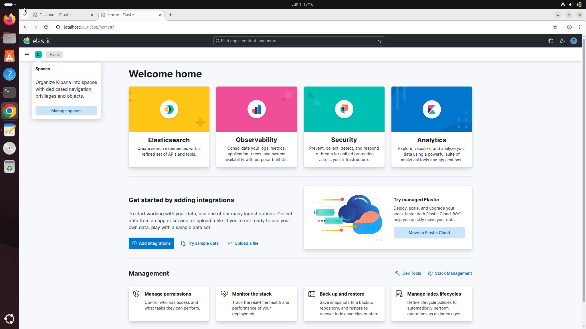
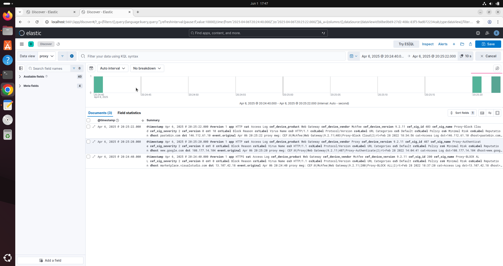
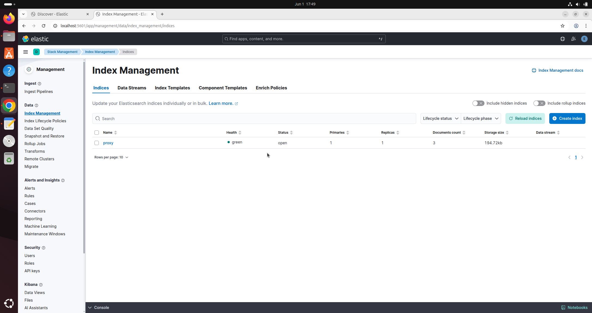
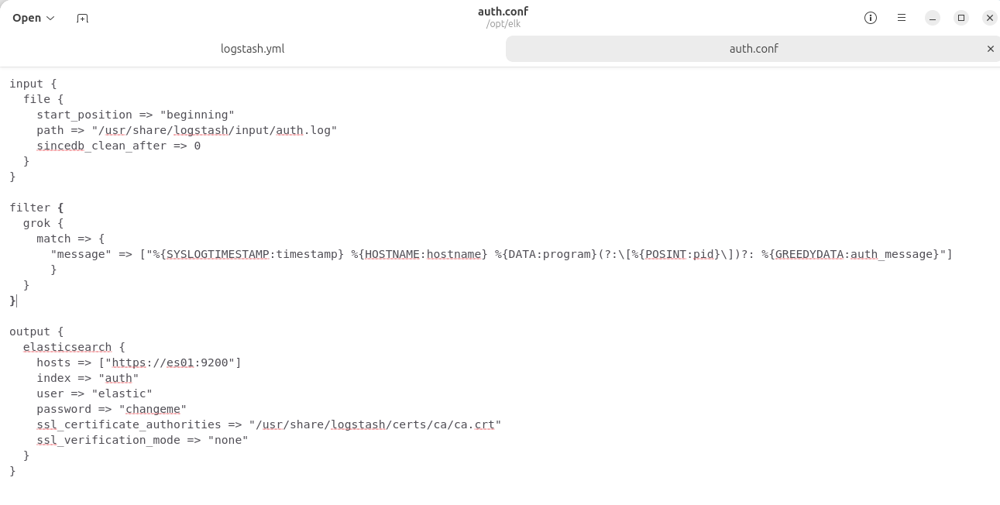
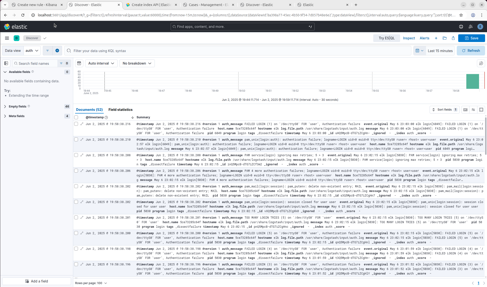
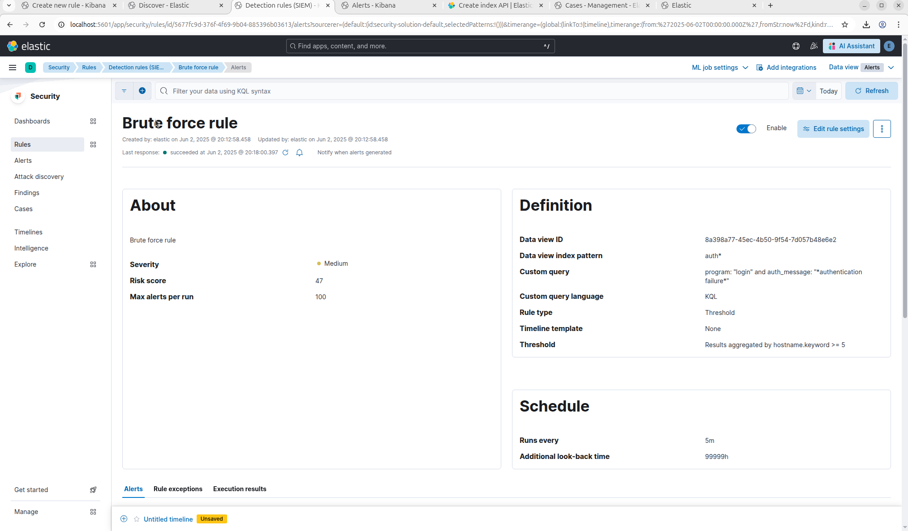
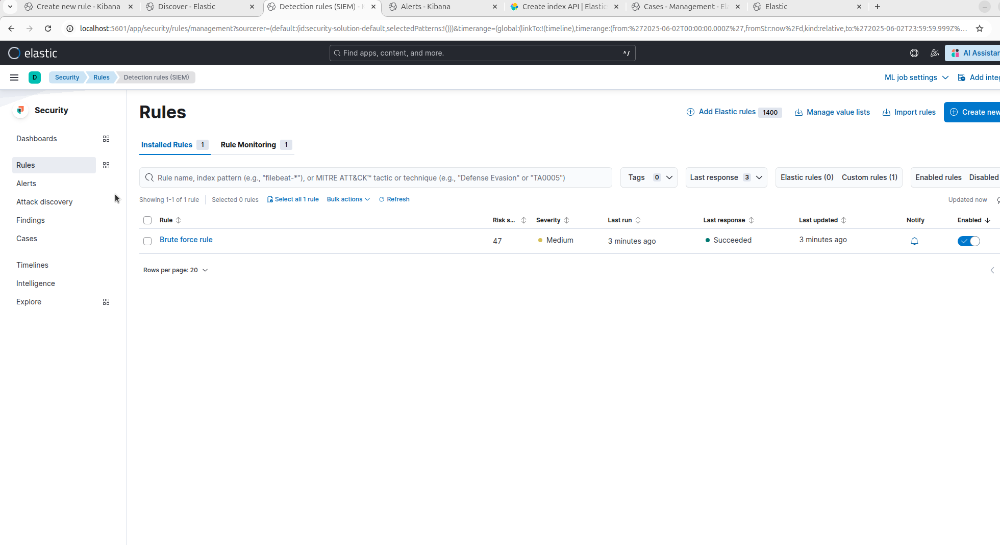

# Задание 1

###  
Интерфейс Kibana

## Список отрываемых портов
- 9200 - Elasticsearch
- 5601 - Kibana
- 5000-5001, 5044 - Logstash

# Задание 2

###  
Cодержимое лога proxy.log

###  
Название индекса во вкладке Index Management.

# Задание 3 

###  
Правила фильтрации в auth.conf

###  
Скриншоты DataView auth-лога

###  
Правило определения brute force

###  
Сработка правила

