# Модуль 2. Сканирование сетей (HW)

## Лабораторная работа №1 (HW)

### Шаг 1. Настраиваем сетевой мост между хост-системой Windows и VM Kali Linux

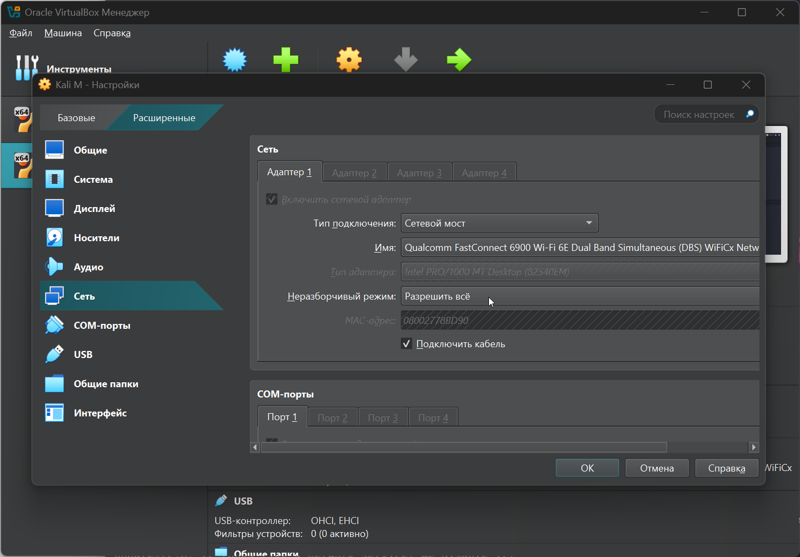

### Шаг 2. Устанавливаем vsftpd на Kali Linux

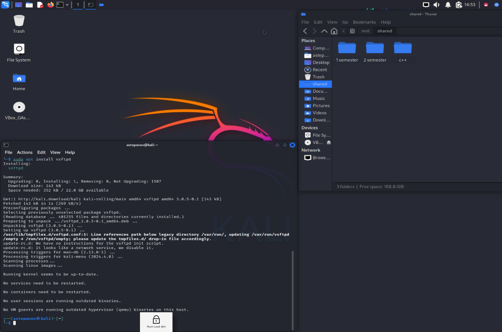

##ч# Шаг 3. Создаем новый конфиг для vsftpd

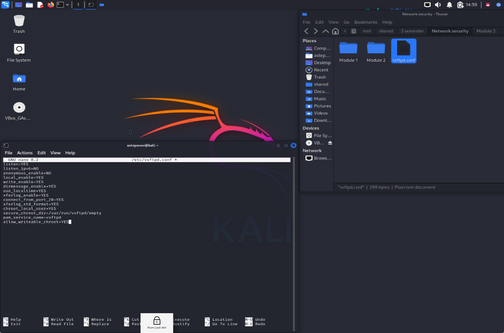

### Шаг 4. Перезагружаем службу

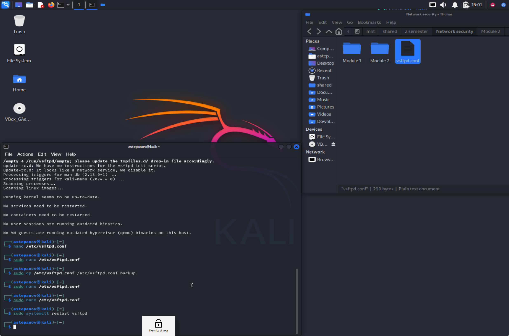

### Шаг 5. Создаем нового пользователя ftpuser с паролем 123456

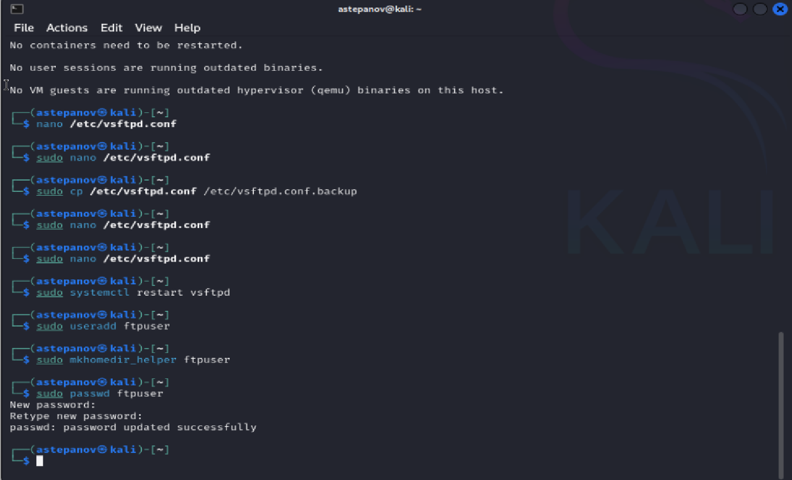

### Шаг 6. Создаем в домашней директории нового пользователя файл helloworld.txt

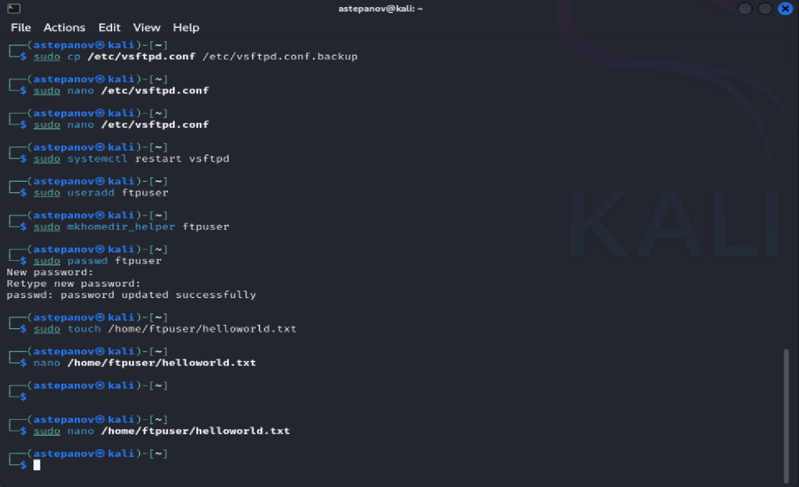

### Шаг 7. Запускаем Wireshark и начинаем слушать интерфейс eth0, который находится в одной локальной сети с хост-машиной Windows.

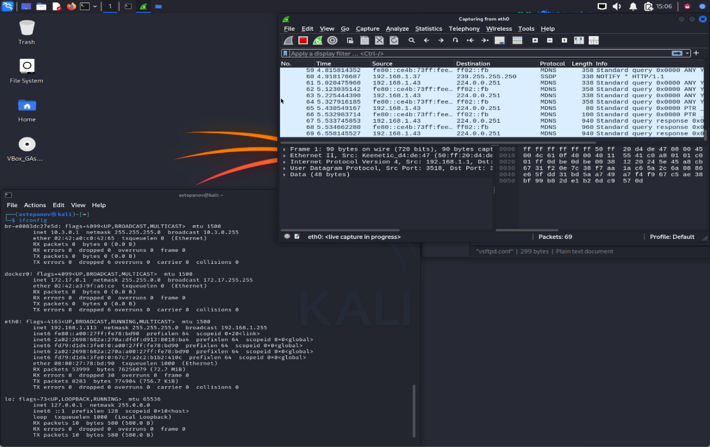

### Шаг 8. Подключаемся по ftp с хостовой машины на машину Kali по ip-адресу интерфейса eth0 (192.168.1.113)

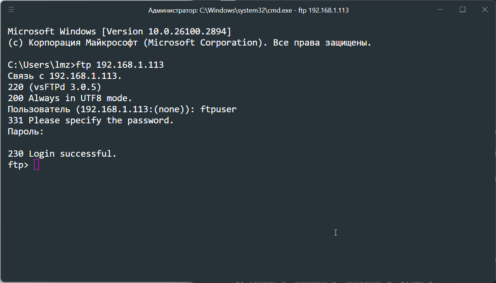

**Вводим логин и пароль юзера **ftpuser** - подключение успешно выполнено**

### Шаг 9. Загружаем созданный файл по ftp

1. После подключения по ftp переходим в бинарный режим (для скачивания файлов)
2. Скачиваем файл командой get
3. Проверяем командой dir, что файл сказался в директорию хост-машины

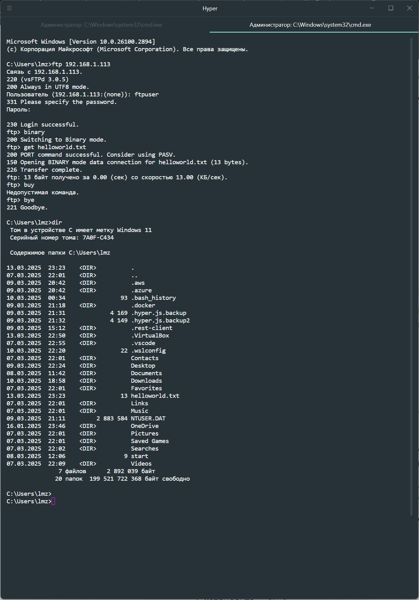

### Шаг 10. Изучаем содержимое пакетов в Wireshark

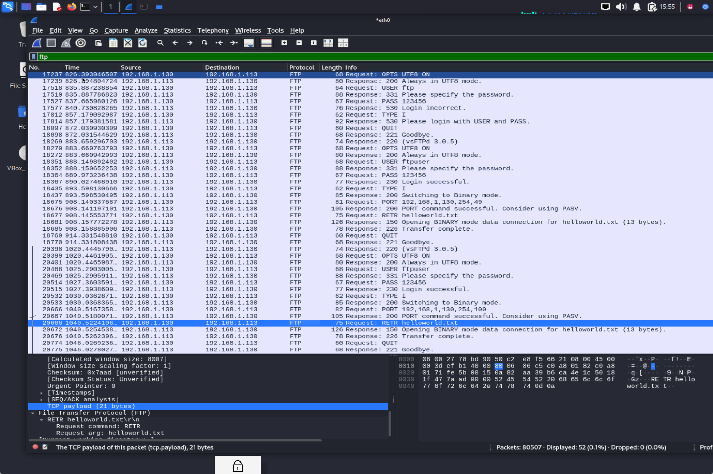

Для удобства пакеты были отфильтрованы в Wireshark по протоколу FTP.

#### Общие выводы по работе протокола FTP
Сам протокол довольно простой.
Клиент (192.168.1.130) и сервер (192.168.1.113) общаются между собой, обмениваясь пакетами типа "ЗАПРОС" - "ОТВЕТ", передавая внутри пакета простые команды.
Запрос представляет из себя команду с 2 (основынми) полями - тип команды и аргумент команды.
Ответ так же содержит 2 (основных) поля - код ответа и аргумент ответа.

Порядок взаимодействия клиента и сервера:
1) Клиент инициирует взаимодействие с FTP-сервером, передавая TCP-пакет на 21-ый управляющий порт FTP-сервера
2) Сервер отвечает клиенту по FTP-протоколу, передавая 220 код, сообщающий о готовности к ftp-сессии с новым пользователем
3) Клиент передает серверу команду OPTS с аргументом UTF8 ON, определяющую кодировку в формате UTF-8
4) Далее клиент и сервер обмениваются информацией о пользователе и пароле, производя аутентификацию
5) В момент перед началом передачи данных с сервера на клиент, клиент отправляет на сервер данные об ip-адресе и о порте, через который будет произведена передача данных с сервера командой с кодом **PORT** и аргументом **192,168,1,130,254,100**, где два последних числа определяют порт передачи бинарных данных: **254*256+100=65124**
6) Сервер сообщает клиенту о том, что порт успешно открыт и передача данных будет производится в пассивном режиме
7) Клиент посылает серверу команду RETR (retrieve - получить), с именем файла в аргументе, на получение файла. Сервер проверяет, существует ли файл и есть ли у клиента права на его скачивание. Если файл доступен, сервер открывает соединение для передачи данных и начинает отправку файла. Клиент получает файл и сохраняет его.
8) По окончанию скачивания сервер присылает клиенту ответ об успешном скачивании файла.
9) Клиент закрывает соединение
10) Сервер закрывает соединиение

## Часть 2

### Шаг 1. Устанавливаем и запускаем сервис vsftpd

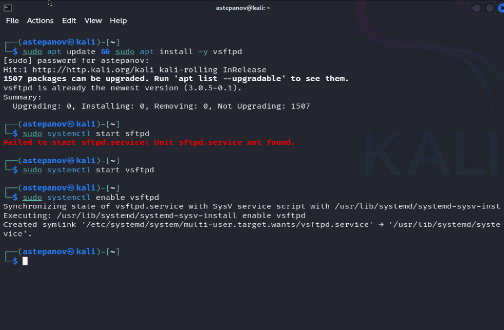

### Шаг 2. Создаем SSL-сертификат шифрования

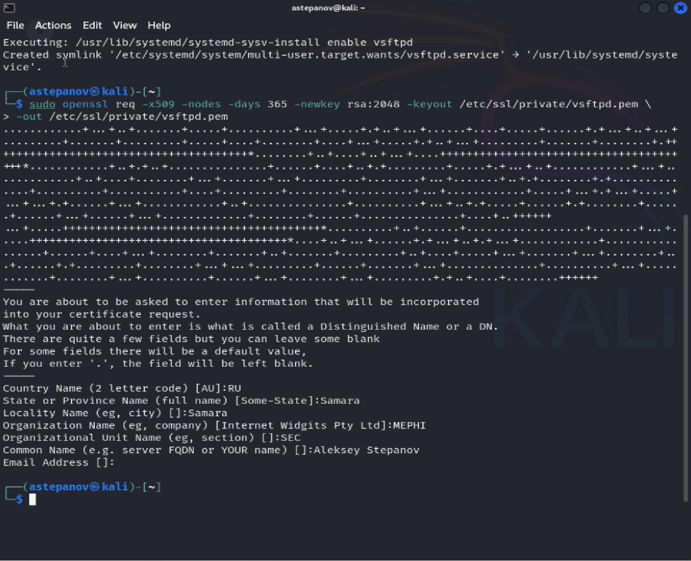


| Флаг | Значение |
|------|---------|
| `openssl` | Запускает утилиту OpenSSL (для работы с криптографией) |
| `req` | Использует модуль OpenSSL для создания запроса на сертификат (CSR) или самоподписанного сертификата |
| `-x509` | Генерирует **самоподписанный** сертификат (без запроса CSR) |
| `-nodes` | Означает **"No DES"** – создается ключ **без пароля** (не шифруется, чтобы сервер мог загружаться без ввода пароля) |
| `-days 365` | Срок действия сертификата **365 дней** |
| `-newkey rsa:2048` | Создает **новую пару ключей**: приватный и публичный, используя **RSA с длиной 2048 бит** |
| `-keyout /etc/ssl/private/vsftpd.pem` | Указывает, **куда сохранить приватный ключ** (и сертификат, т.к. они объединены в один файл) |
| `-out /etc/ssl/private/vsftpd.pem` | Указывает, **куда сохранить самоподписанный сертификат** |

### Шаг 3. Настройка vsftpd для работы с FTPS

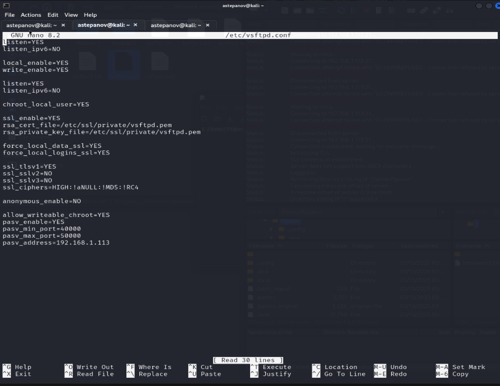

Описание настроек конфига vsftpd.conf
| Параметр                     | Описание |
|------------------------------|----------|
| `listen=YES`                 | Включает режим standalone (прослушивание входящих подключений). |
| `listen_ipv6=NO`             | Отключает прослушивание IPv6, оставляя только IPv4. |
| `local_enable=YES`           | Разрешает локальным пользователям вход в FTP. |
| `write_enable=YES`           | Разрешает пользователям выполнять операции записи (создавать, изменять, удалять файлы). |
| `chroot_local_user=YES`      | Ограничивает пользователей их домашним каталогом (chroot jail). |
| `allow_writeable_chroot=YES` | Разрешает запись в корневую директорию пользователя в `chroot`-режиме (иначе vsftpd может отказать в запуске). |
| `ssl_enable=YES`             | Включает поддержку SSL/TLS для безопасного соединения. |
| `rsa_cert_file=/etc/ssl/private/vsftpd.pem` | Указывает путь к SSL-сертификату для шифрования соединений. |
| `rsa_private_key_file=/etc/ssl/private/vsftpd.pem` | Указывает путь к закрытому ключу SSL. |
| `force_local_data_ssl=YES`   | Принудительно шифрует весь FTP-трафик (данные). |
| `force_local_logins_ssl=YES` | Принудительно требует шифрованный вход (логин и пароль передаются через TLS/SSL). |
| `ssl_tlsv1=NO`               | Отключает использование устаревшего протокола TLS 1.0. |
| `ssl_tlsv1_2=YES`            | Разрешает использование TLS 1.2. |
| `ssl_tlsv1_3=YES`            | Разрешает использование TLS 1.3. |
| `ssl_sslv2=NO`               | Отключает устаревший и небезопасный SSLv2. |
| `ssl_sslv3=NO`               | Отключает устаревший и небезопасный SSLv3. |
| `anonymous_enable=NO`        | Запрещает анонимные подключения к FTP. |
| `pasv_enable=YES`            | Включает пассивный режим FTP (необходим для работы за NAT или файрволами). |
| `pasv_min_port=40000`        | Устанавливает минимальный порт для пассивных FTP-соединений. |
| `pasv_max_port=50000`        | Устанавливает максимальный порт для пассивных FTP-соединений. |
| `pasv_address=192.168.1.113` | Указывает IP-адрес сервера, который будет использоваться для пассивного режима (нужно при работе через NAT). |

>⚠️ Если pasv_address не задан, сервер может отправить клиенту свой внутренний
> IP, и соединение не установится, если клиент снаружи сети. Данную настройку
> нужно устанавливать, если клиент подключается из другой сети.

> ⚠️ ```allow_writeable_chroot=YES``` - этот параметр потребовалось добавить в
> конфиг, так как без него подключение выдавало ошибку `"refusing to run with
> writable root inside chroot()"`. Причина заключается в том, что по умолчанию
> vsftpd запрещает подключение, если корневая папка (chroot) пользователя доступна  
> для записи, так как это представляет потенциальную угрозу безопасности, а на шаге 5 мы как раз выдаем полный доступ на домашнюю папку пользователя.

### Шаг 4. Перезапускаем vsftpd для сохранения настроек

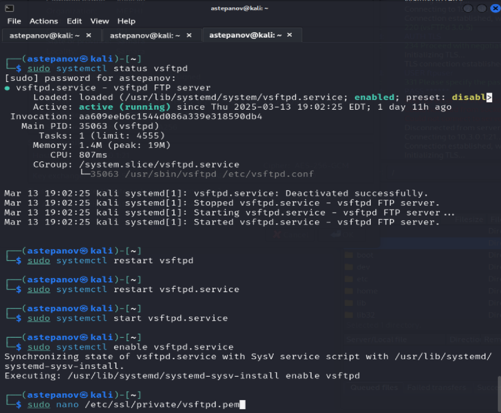

### Шаг 5. Добавляем пользователя для FTPS

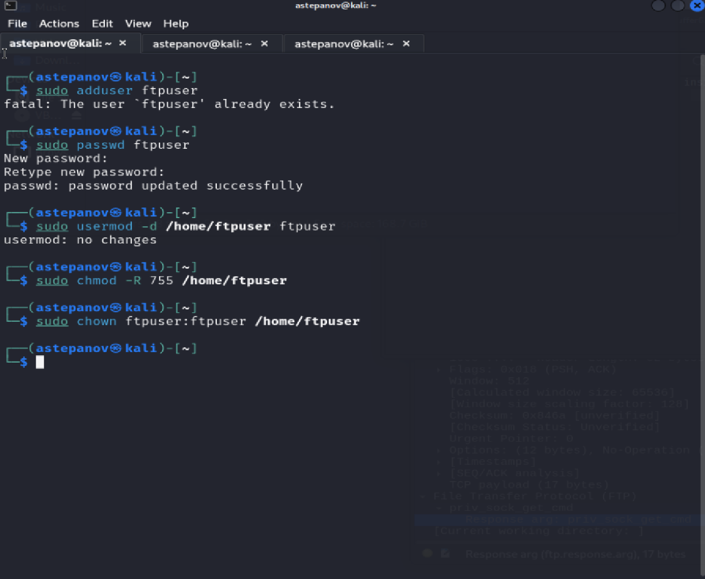

### Разбор команд

| Команда | Описание |
|---------|----------|
| `sudo adduser ftpuser` | Создаёт пользователя `ftpuser` с домашней директорией `/home/ftpuser`. |
| `sudo passwd ftpuser` | Устанавливает пароль для `ftpuser`. |
| `sudo usermod -d /home/ftpuser ftpuser` | Устанавливает `/home/ftpuser` как домашнюю папку пользователя. |
| `sudo chmod -R 755 /home/ftpuser` | Даёт `ftpuser` полный доступ (`rwx`), остальным (`r-x`). |
| `sudo chown ftpuser:ftpuser /home/ftpuser` | Назначает владельцем `ftpuser` и устанавливает его группу. |

### Шаг 6. Проверяем соединение

**Настройки ftp подключения в FileZilla**
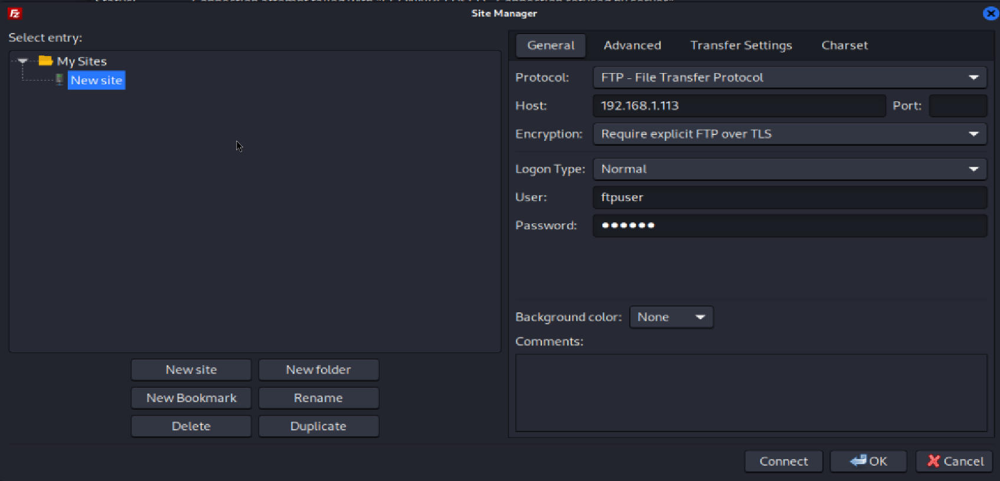

**Подключаемся к ftp-серверу. Подкюлчение предлагает принять ранее созданный нами tls-сертификат**
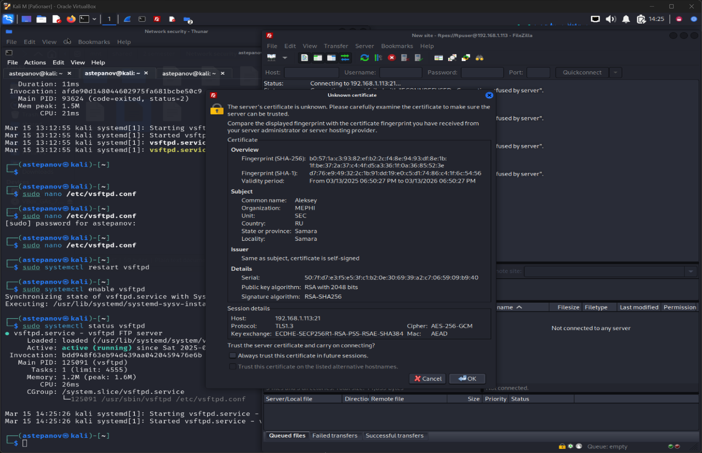

**Подключение успешно установлено**
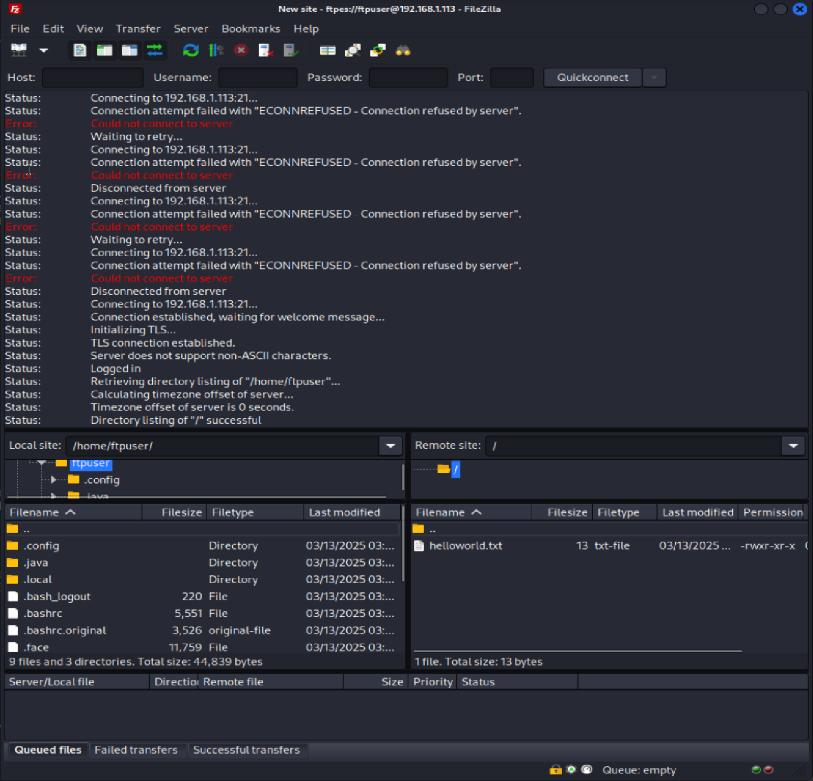

### Шаг 7. Сканирование FTP-трафика в Wireshark

Ключевое отличие в передаче трафика заключается в том, что теперь подключение по FTP - шифруется и, при перехвате трафика, содержимое пакетов нельзя просто так прочитать. Это обеспечивает безопасность при передаче данных по FTP.
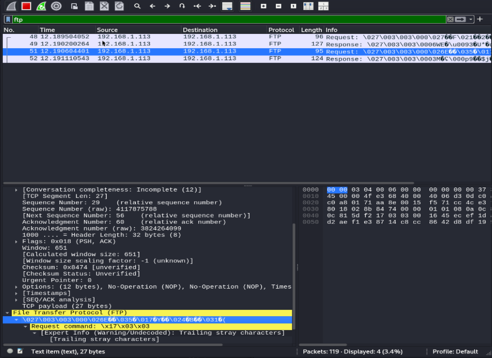