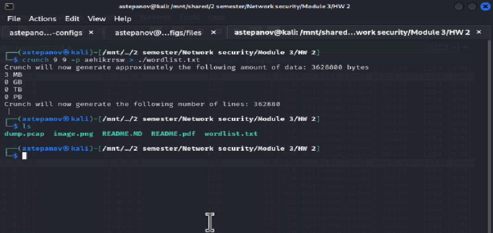
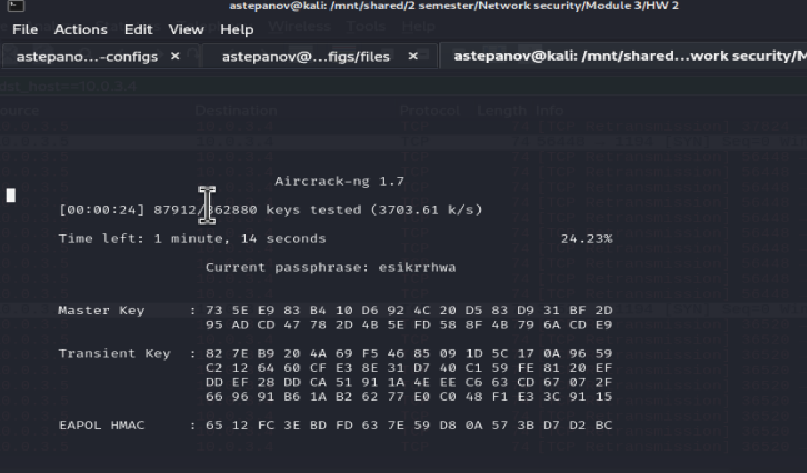
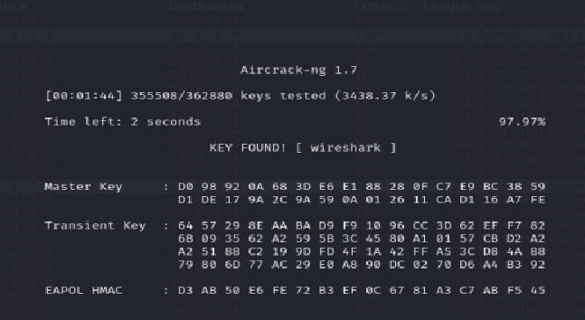

# Модуль 3. Виртуальные защищенные каналы связи, DMZ, Wi-Fi (HW)

## Лабораторная работа №2 (HW)

### Шаг 13 Создайте словарь из символов алфавита aehikrrsw

Создаем словарь из заданного алфавита с помощью утилиты **crunch** и сохраняем словарь в директорию рядом с pcap-файлом

### Шаг 14 Произведите атаку на полученный pcap файл при помощи сгенерированного (скачанного) словаря

Перебираем ключи с помощью утилиты **aircrack-ng**, передав параметром -w - словарь, по которому мы будем перебирать значения...

Спустя пару минут ключ найден: **wireshark**
