# Анализ кода (SAST/DAST/SCA) на примере OWASP Juice Shop

## SAST-анализ

### Sonar cube

 Для SAST-сканирования был выбран SonarCube, так как с этой системой я сталкивался на одном из 
предыдущих мест работы (как разработчик) и было бы интересно разобраться как она работает и настраивается.

Для запуска SonaeCube локально - выбираем Community Edition и устанавливаем локально по инструкции с помощью Docker. Это самый удобный и быстрый способ запуска, позволяющий не исправлять десятки ошибок, возникающих в процессе.

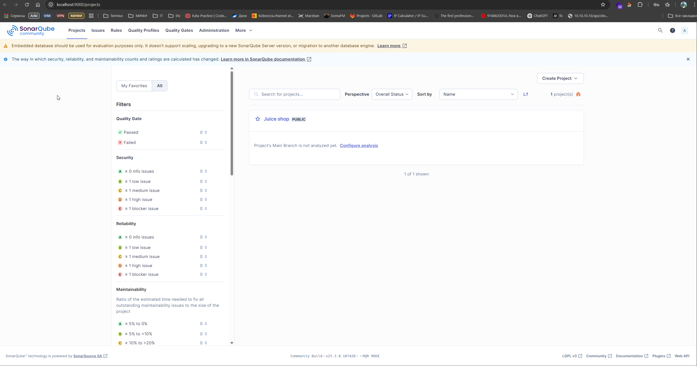
Запуск SonarCube локально в Docker с пробросом на 9000 порт

### Настройка анализа проекта

Так как анализируемы проект Juice Shop установлен локально и никаких CI/CD не настроено, то для анализа проекта мы так же должны просто выбрать локально установленнй проект.

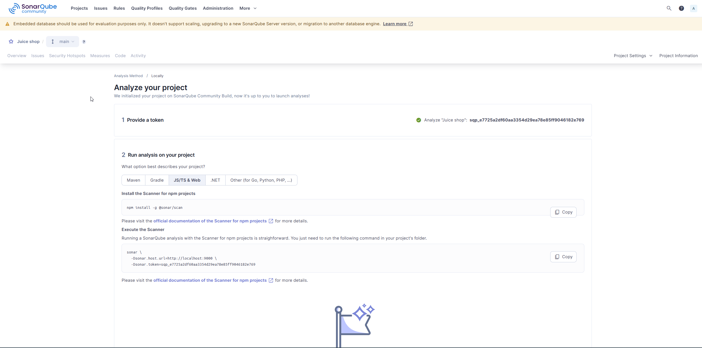
Sonar предлагает интуитивно понятную инструкцию для проведения статического анализа локально установленного проекта. Для этого достаточно установить глобально npm-пакет @sonar/scan и запустить анализ из-под анализируемой директории.

### Запуск анализа проекта

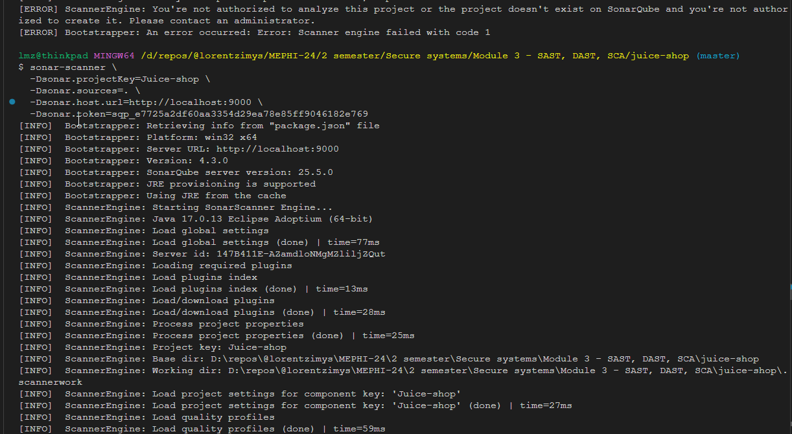
После запуска предложенного скрипта с заданным ключом в корне проекта - был произведен автоматический анализ кодовой базы проекта.
Здесь стоит сделать оговорку, что так как в процессе выполнения ДЗ была использована open source Community Edition версия продукта, то она не позволяет полноценно настраивать анализ уязвимостей для OWASP Top 10 (Developer edititon позволяет), так что для анализа был выбран quality gate по умолчанию **Sonar way**, который тем не менее включают ряд правил, связанных с безопасностью, которые пересекаются с пунктами OWASP Top 10

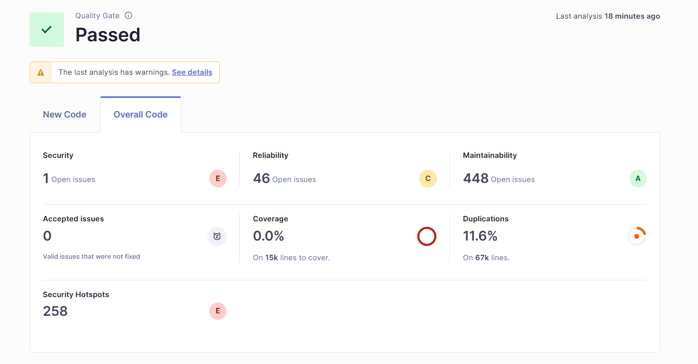
Итоговый результат прохождения SAST-анализа

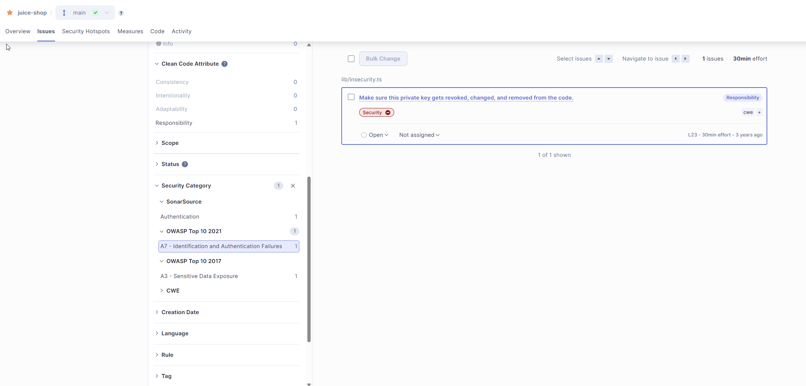
Security issues, в том числе из OWASP Top 10

### Соберите отчет о найденных уязвимостях

Отчет о найденных уязвимостях в SonarCube доступен только в решениях **Enterprise edition**, поэтому отчет в **Community edition** сформировать не получится.

---------------
### Semgrep

Так как полностью выполнить задание в SonarCube Community Edition не получилось, провел дополнительный анализ в Semgrep.

#### Установка Semgrep-cli

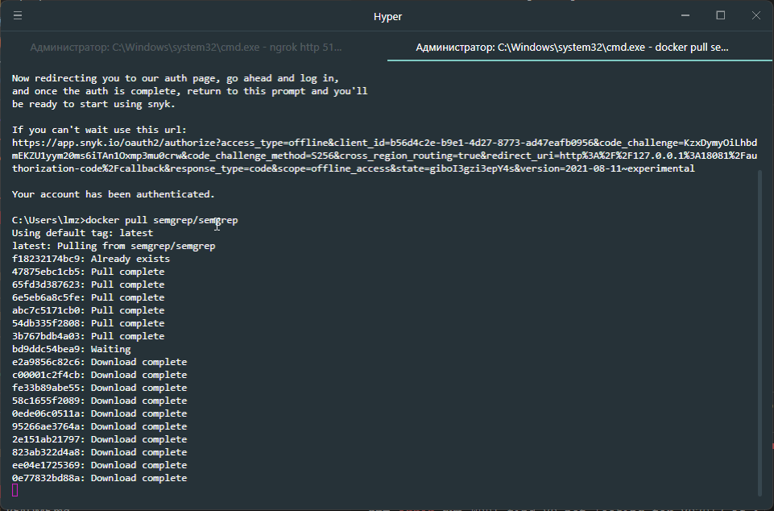
Устанавливаем Semgrep-cli

#### Запуск анализа

Запускаем Semgrep сканирование проекта командой

```
 docker run -e SEMGREP_APP_TOKEN=706379afb27e72607d0c99f641132805186bd6901c71af072c02deccb9954161 --rm -v "${PWD}:/src" semgrep/semgrep semgrep ci
```

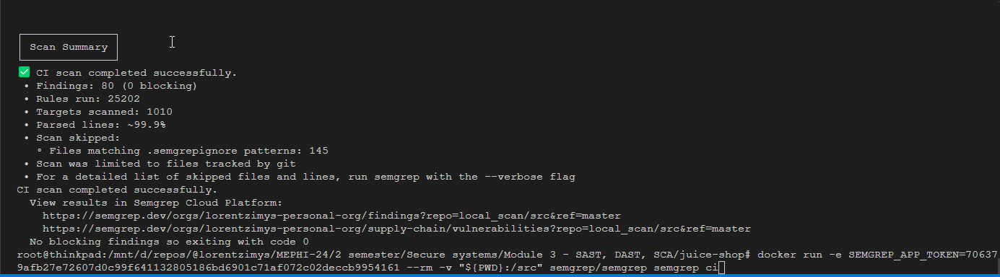
Результат сканирования можно мосмотреть в веб-интерфейсе на сайте https://semgrep.dev/

#### Настройка отображения результатов

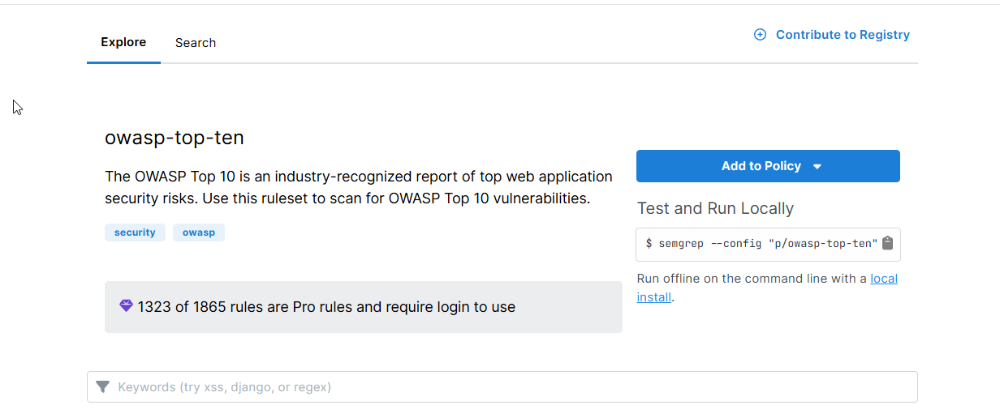
Для того, чтобы использовать набор правил **OWASP Top 10** - устанавливаем их через **"Add rules"**

После установки дополнительного набора правил - его можно будет выбрать в панели фильтрации для анализируемого кода. Получаем 54 уязвимости из **OWASP Top 10** 
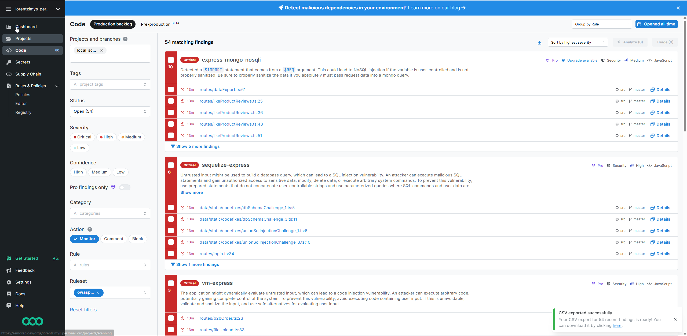

Отчет по найденным уязвимостям доступен в CSV формате для скачивания 


##  Анализ результатов SAST

### Критические уязвимости (Critical)

----

```javascript.express.code.eval-express.eval-express```

**Описание**:

В приложении может использоваться eval или аналогичная функция, что приводит к удалённому выполнению кода.

**Файл и строка**: ```routes/redeem.js#L41```

**Severity**: High

----

```javascript.express.code.vm-express.vm-express```

**Описание**:

Использование встроенного модуля vm в Node.js может привести к выполнению опасного кода, особенно при небезопасной передаче данных в контекст исполнения.

**Файл и строка**: ``routes/complain.js#L27``

**Severity**: High

---

```javascript.express.db.sequelize-express.sequelize-sqli```

**Описание**:

Входные данные могут использоваться для построения SQL-запросов в ORM Sequelize, что может привести к SQL-инъекции.

**Файл и строка**: ``routes/dataExport.js#L22``

**Severiy**: High

(Подобные уязвимости также встречаются в других строках этого и соседних файлов.)

---

### Возможные ложные срабатывания (False Positives)
Использование ``eval`` или `vm` может быть безопасным при строгой проверке или контроле данных. Необходимо убедиться, что перед выполнением происходит фильтрация, whitelisting или sandboxing.

``Sequelize`` может быть уязвим только в случае использования небезопасной подстановки переменных. Использование параметров в запросах устраняет угрозу.

В некоторых случаях Semgrep может среагировать на шаблонный код или тестовые сценарии.

## Рекомендации по устранению уязвимостей SAST
 - Избегать использования eval, Function, vm.runInNewContext, особенно с данными от пользователя.

 - Всегда использовать параметризованные SQL-запросы в Sequelize (where: { id: userInput } вместо строки SQL).

 - Провести ревизию кода с участием команды безопасности.

 - Пометить ложные срабатывания как false positives в Semgrep, при наличии обоснования.

 - Обновить линтеры и применить security rules на этапе CI/CD.


## DAST-анализ

### Проведение DAST анализа с помощью OWASP Zap
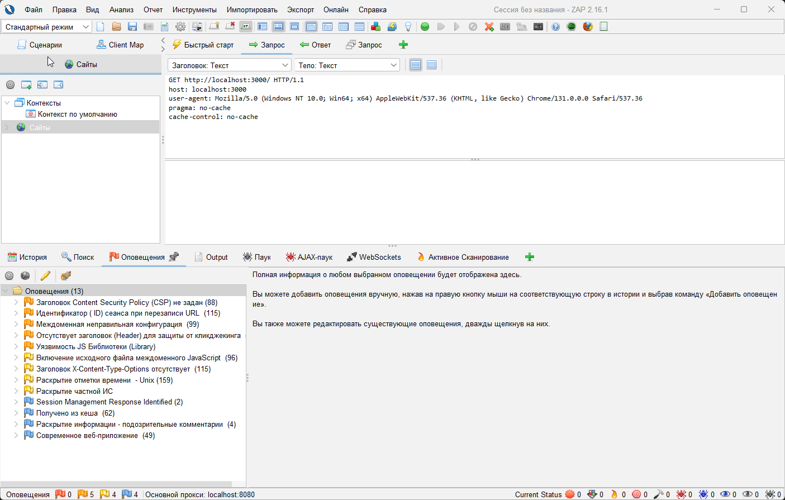
Автоматическое сканирование запущенного сервиса на localhost:3000 с помощью OWASP ZAP показало 13 оповещений безопасности - 5 medium, 4 low и 4 info.

Активное сканирование показало больше оповещений:
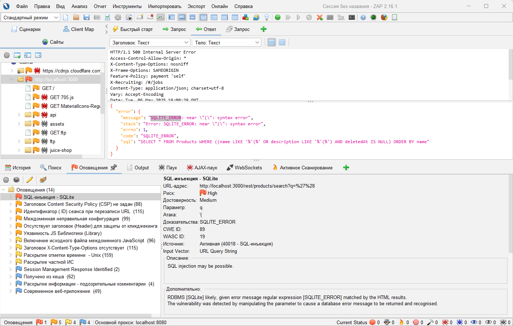


### Анализ результатов DAST

#### SQL-инъекция - SQLite

Риск - Высокий

Достоверность - Средняя

Эндпоинт - http://localhost:3000/rest/products/search?q=%27%28

Описание - СУБД: [SQLite], вероятно, поскольку в HTML-ответе найдена ошибка, соответствующая регулярному выражению [SQLITE_ERROR].
Уязвимость была обнаружена путём изменения параметра, что вызвало сообщение об ошибке базы данных, которое было распознано.

Решение:
- Не доверяйте данным от клиента, даже если есть валидация на фронтенде.
- Проверяйте типы всех входящих данных на стороне сервера.
- Используйте параметризованные запросы:
- Для JDBC: PreparedStatement, CallableStatement.
- Для ASP: ADO Command с типизированными параметрами.
- Используйте хранимые процедуры, если возможно.
- Не формируйте SQL-запросы через конкатенацию строк:
- Не используйте exec, exec immediate и подобные механизмы.
- Экранируйте пользовательские данные, если параметры невозможны.
- Применяйте "белый список" допустимых символов во вводе.
- Минимизируйте привилегии базы данных:
- Не используйте sa, db-owner.
- Выдавайте только необходимые права.

---

#### Заголовок Content Security Policy (CSP) не задан

Риск - Средний

Достоверность - Высокая

Эндпоинт - http://localhost:3000

Описание - Политика безопасности содержимого (CSP) — это дополнительный уровень безопасности, который помогает обнаруживать и смягчать определенные типы атак, включая межсайтовые сценарии (XSS) и атаки с внедрением данных. Эти атаки используются для всего: от кражи данных до порчи сайта или распространения вредоносных программ. CSP предоставляет набор стандартных HTTP-заголовков, которые позволяют владельцам веб-сайтов объявлять утвержденные источники контента, которые браузеры должны разрешить загружать на эту страницу. Охватываемые типы включают JavaScript, CSS, HTML-фреймы, шрифты, изображения и встраиваемые объекты, такие как апплеты Java. ActiveX, аудио и видео файлы.

Решение - добавить CSP заголовок во все HTTP запросы

---


#### Идентификатор ( ID) сеанса при перезаписи URL 

Риск - Средний

Достоверность - Высокая

Эндпоинт - http://localhost:3000/socket.io/?EIO=4&transport=websocket&sid=AfnaxCGzK0DsKFFVAAAA

Описание - Перезапись URL используется для отслеживания идентификатора сеанса пользователя. 
Идентификатор сеанса может быть раскрыт через заголовок межсайтового реферера. 
Кроме того, идентификатор сеанса может храниться в истории браузера или журналах сервера. 

Решение - Для безопасного содержимого поместите идентификатор сеанса в файл cookie. 
Для большей безопасности рассмотрите возможность использования комбинации файлов cookie и перезаписи URL. 

---

#### Междоменная неправильная конфигурация 

Риск - Средний

Достоверность - Средняя

Доказательство - **Access-Control-Allow-Origin: \***

Описание - Загрузка данных в веб-браузере может быть возможна из-за неправильной настройки CORS (Cross-Origin Resource Sharing) на веб-сервере.
Неправильная конфигурация CORS на веб-сервере разрешает междоменные запросы чтения из произвольных сторонних доменов 
с использованием неаутентифицированных API в этом домене. 
Однако реализации веб-браузера не разрешают произвольным третьим сторонам читать ответ от аутентифицированных API. 
Это несколько снижает риск. 
Эта неправильная конфигурация может быть использована злоумышленником для доступа к данным, 
которые доступны без аутентификации, но которые используют другую форму безопасности, 
такую как белый список IP-адресов. 

Решение - Убедитесь, что конфиденциальные данные недоступны без аутентификации 
(например, с помощью белого списка IP-адресов).
Настройте HTTP-заголовок «Access-Control-Allow-Origin» для более ограниченного набора доменов 
или полностью удалите все заголовки CORS, 
чтобы разрешить веб-браузеру применять ту же политику происхождения (SOP) 
более ограничительным образом. 

---

#### Отсутствует заголовок (Header) для защиты от кликджекинга 

Риск - Средний

Достоверность - Средняя

Доказательство - **Access-Control-Allow-Origin: \***

Описание - Ответ сервера не защищён от атак типа ClickJacking.
Необходимо добавить либо заголовок Content-Security-Policy с директивой frame-ancestors, либо заголовок X-Frame-Options.

Решение - Современные веб-браузеры поддерживают Content-Security-Policy и заголовки HTTP X-Frame-Options. Убедитесь, что один из них установлен на всех веб-страницах, возвращаемых вашим сайтом/приложением.Если вы ожидаете, что страница будет обрамлена только страницами на вашем сервере (например, это часть FRAMESET), вам следует использовать SAMEORIGIN, в противном случае, если вы никогда не ожидаете, что страница будет обрамлена, вам следует использовать DENY.В качестве альтернативы рассмотрите возможность реализации директивы Content Security Policy «frame-ancestors».

---

## SCA-анализ

Для проведения SCA анализа был выбран Snyk (так как он используется на текущей работе).

Результат проверки npm-библиотек в package.json сервиса Juicy Shop:
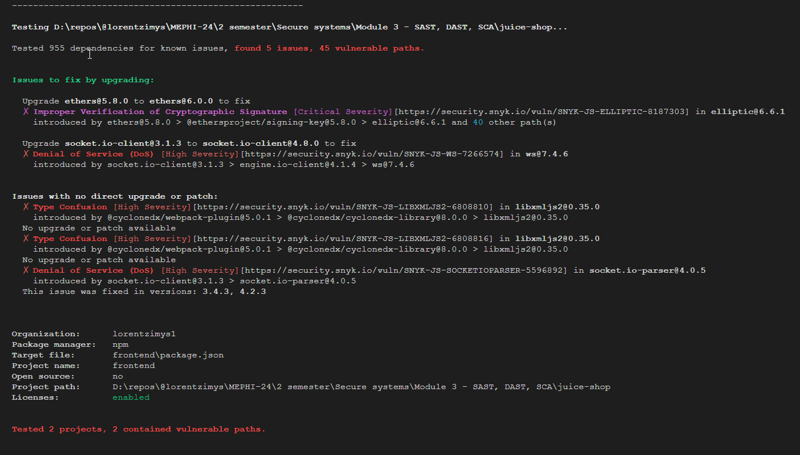

### Разбор выявленных уязвимостей

Уязвимость: Improper Verification of Cryptographic Signature

Библиотека: ``ethers@5.8.0``

Критичность: Critical

Уязвимый пакет: elliptic@6.6.1

Путь: ethers@5.8.0 → @ethersproject/signing-key@5.8.0 → elliptic@6.6.1

Решение: Обновите ethers до версии 6.0.0 или выше

---

Уязвимость: Denial of Service (DoS)

Библиотека: ``socket.io-client@3.1.3``

Критичность: High

Уязвимый пакет: ws@7.4.6

Путь: socket.io-client@3.1.3 → engine.io-client@4.1.4 → ws@7.4.6

Решение: Обновите socket.io-client до версии 4.8.0 или выше.

---

Уязвимость: Type Confusion (2 случая)

Библиотека: ``libxmljs2@0.35.0``

Критичность: High

Путь: @cyclonedx/webpack-plugin@5.0.1 → @cyclonedx/cyclonedx-library@8.0.0 → libxmljs2@0.35.0

Проблема: Нет доступного обновления или патча.

Рекомендации:
 - Избегайте использования плагина @cyclonedx/webpack-plugin, если он не критичен.

 - Ограничьте его использование в продакшене.

 - Следите за обновлениями этого пакета.

 - Контейнируйте сборку или запуск в sandbox среде (например, через Docker).

---

Уязвимость: Denial of Service (DoS)

Библиотека: ``socket.io-parser@4.0.5``

Критичность: High

Путь: socket.io-client@3.1.3 → socket.io-parser@4.0.5

Решение: Обновить socket.io-client до 4.2.3 или выше, где зависимость обновлена.


### Общие рекомендации
- Запустите npm audit fix — это может автоматически исправить часть уязвимостей.

- Обновляйте зависимости регулярно, особенно те, что участвуют в безопасности

 - Если невозможно обновить зависимость, рассмотрите её замену или изоляцию