# Модуль 4. Лучшие практики для трендовых языков программирования, безопасность WEB-приложений. Сетевые атаки

## Часть 1: Найдите все допущенные уязвимости в коде

Исходный код:
```go
package main

import (
    "database/sql"
    "fmt"
    "log"
    "net/http"
    "os/exec"

    _ "github.com/lib/pq"
)

func main() {
    db, err := sql.Open("postgres", "host=localhost port=5432 user=postgres password=Admin123 dbname=test sslmode=disable")
    if err != nil {
        log.Fatal(err)
    }
 
    defer db.Close()

    http.HandleFunc("/login", func(w http.ResponseWriter, r *http.Request) {
        if r.Method == http.MethodPost {
            username := r.FormValue("username")
            password := r.FormValue("password")

            query := fmt.Sprintf("SELECT id FROM users WHERE username='%s' AND password='%s'", username, password)
            row := db.QueryRow(query)

            var userID int
            err := row.Scan(&userID)
            
            if err != nil {
                http.Error(w, "Invalid credentials or DB error: "+err.Error(), http.StatusUnauthorized)
                return
            } // Выдаем (условно) «сессию»

                       cookie := &http.Cookie{
                Name:  "session",
                Value: fmt.Sprintf("%s|%s", username, password), 
            }
            http.SetCookie(w, cookie)

            w.Write([]byte("Login successful!"))
            return
        }

        http.Error(w, "Only POST allowed", http.StatusMethodNotAllowed)
    })

    http.HandleFunc("/debug", func(w http.ResponseWriter, r *http.Request) {
        cmd := r.URL.Query().Get("cmd")
        out, _ := exec.Command("sh", "-c", cmd).Output()         w.Write(out)
    })

    log.Println("Server is running on http://localhost:8080/")
    http.ListenAndServe(":8080", nil)
}
```

### Обнаруженные уязвимости

#### 1. SQL-инъекция (SQL Injection)
```go
query := fmt.Sprintf("SELECT id FROM users WHERE username='%s' AND password='%s'", username, password)
```

**Почему опасно:**

Формирование SQL-запроса через `fmt.Sprintf` позволяет атакующему внедрить произвольный SQL-код через поля username и password.

**Безопасная альтернатива:**
```go
query := "SELECT id FROM users WHERE username=$1 AND password=$2"
row := db.QueryRow(query, username, password)
```

#### 2. Хранение пароля в куки

```go
cookie := &http.Cookie{
    Name:  "session",
    Value: fmt.Sprintf("%s|%s", username, password),
}
```

**Почему опасно:**

Хранение паролей в открытом виде в куки — это серьёзная уязвимость. Если куки будут перехвачены, злоумышленник получит логин и пароль пользователя.

**Безопасная альтернатива:**

Использовать сессионный идентификатор (token или UUID), который хранится на сервере.
Куки должны быть с флагами HttpOnly, Secure, SameSite.

```go
// Сгенерировать безопасный токен (упрощено)
sessionToken := generateSecureToken()
storeSessionInMemoryOrDB(sessionToken, userID) // Привязка к пользователю

cookie := &http.Cookie{
    Name:     "session",
    Value:    sessionToken,
    HttpOnly: true,
    Secure:   true, // только при HTTPS
    SameSite: http.SameSiteStrictMode,
}
```

#### 3. Remote Code Execution (RCE) через /debug

**Место:**

```go
cmd := r.URL.Query().Get("cmd")
out, _ := exec.Command("sh", "-c", cmd).Output()
```

**Почему опасно:**

Позволяет удалённому пользователю выполнить произвольные команды на сервере.

**Рекомендации:**

Удалить этот код в продакшене.

Если нужен отладочный интерфейс — разрешать команды только локально и только из разрешённого набора.

Избегать sh -c и динамического выполнения команд.

**Безопасная альтернатива:**

```go
allowed := map[string]string{
    "uptime": "/usr/bin/uptime",
}

cmdKey := r.URL.Query().Get("cmd")
command, ok := allowed[cmdKey]
if !ok {
    http.Error(w, "Command not allowed", http.StatusForbidden)
    return
}
out, err := exec.Command(command).Output()
if err != nil {
    http.Error(w, "Execution error", http.StatusInternalServerError)
    return
}
```

#### 4. Жёстко зашитые учетные данны

**Место:**

```go
sql.Open("postgres", "host=localhost port=5432 user=postgres password=Admin123 dbname=test sslmode=disable")
```

**Почему опасно:**

Пароль в коде легко может попасть в систему контроля версий, особенно в публичные репозитории.

**Решение:**

Использовать переменные окружения.

Или конфигурационные файлы с ограниченным доступом.

**Пример:**

```go
connStr := os.Getenv("DB_CONN_STRING")
db, err := sql.Open("postgres", connStr)
```

## Часть 2: Решите лабораторные работы на сайте PortSwigger

### SQL injection vulnerability in WHERE clause allowing retrieval of hidden data

Проведем подготовку SQL инъекции, закодировав нужные данные SQL инъекции в URL-encoded строку с помощью Burp Suite:
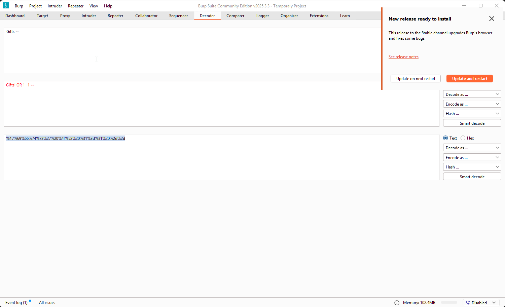

Выполним атаку:
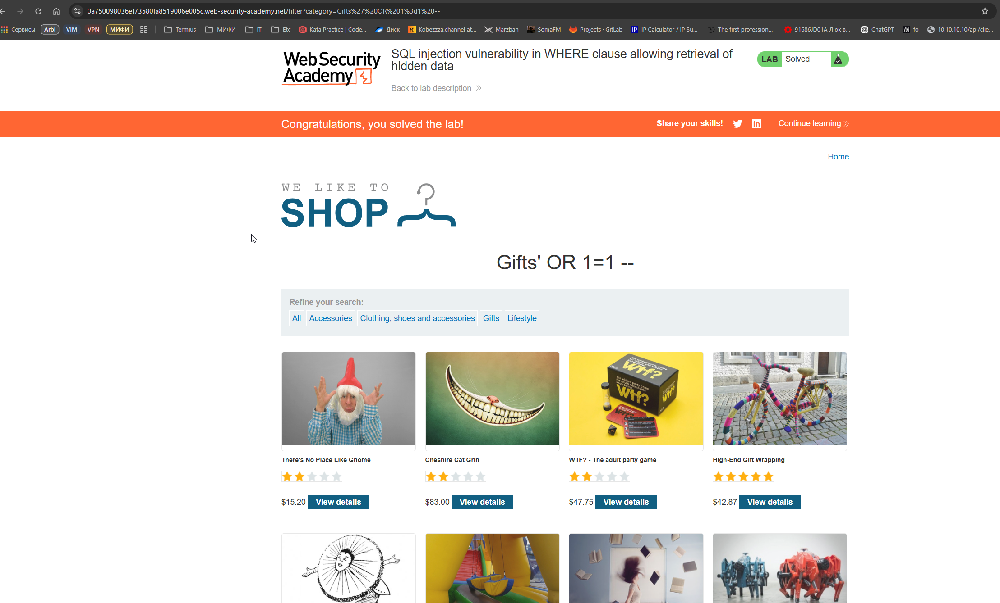

---

### SQL injection vulnerability allowing login bypass


Вторая лабораторная решается аналогичным образом - передаем логин `administrator`,закрываем кавычкой запрос и дальше `--` для комментирования последующего содержимого запроса.

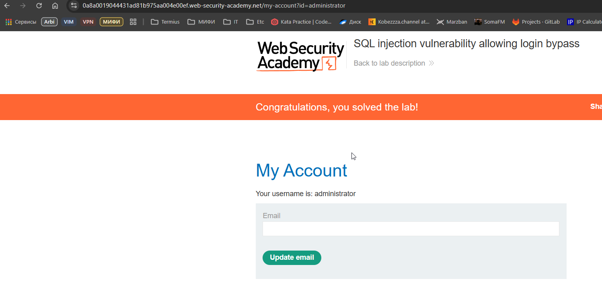
Успешный вход

---

### Lab: Unprotected admin functionality

Если попробовать пройти по ссылке `/robots.txt`, то мы увидим незащищенную функциональность - файл robots.txt, который раскрывает нам некоторую дополнительную информацию о содержимом сервера.
Мы видим, что сайт имеет незакрытый аутентификацией путь `/administrator-panel`

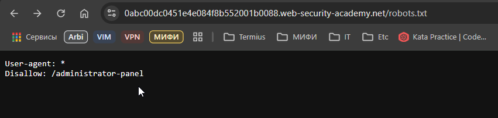

Пройдя по этому пути - нам открывается админ панель, не защищенная никаким паролем и возможность удалить нужного пользователя.

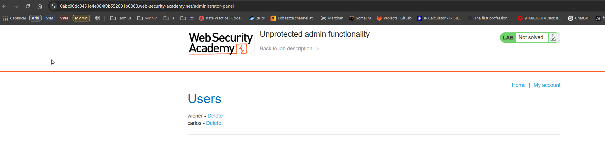

---

### JWT authentication bypass via unverified signature

Через Burp Suite получаем JWT токен после авторизации под доступным нам пользователем
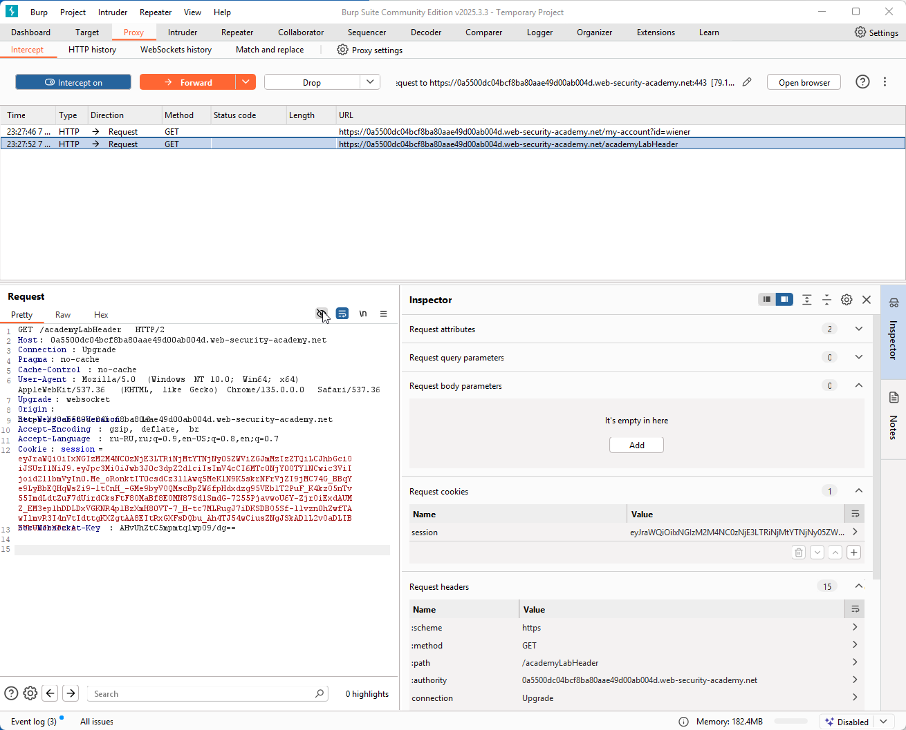

Раскодируем JWT-токен через любой онлайн сервис по работе с JWT токенами и подменяем username на **administrator**
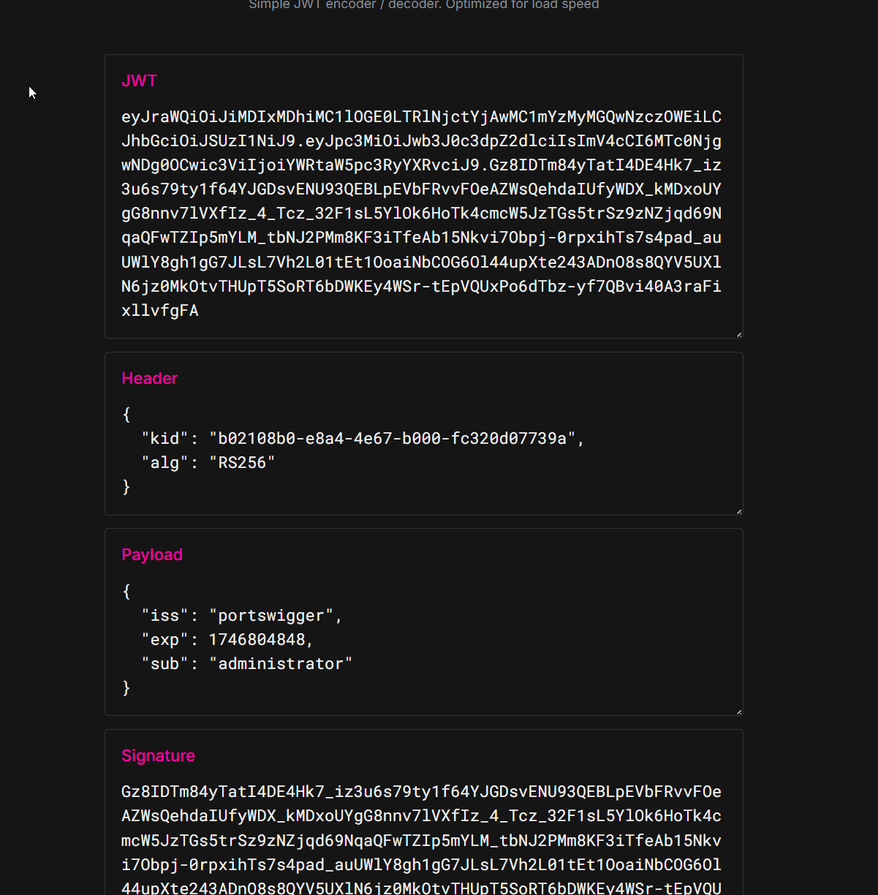

Полученный в результате подмены JWT-токен заменяем в заголовке Cookie **session** для GET-запроса `/my-account`. Так же заменяем query-параметр **id** в запросе на **administrator**
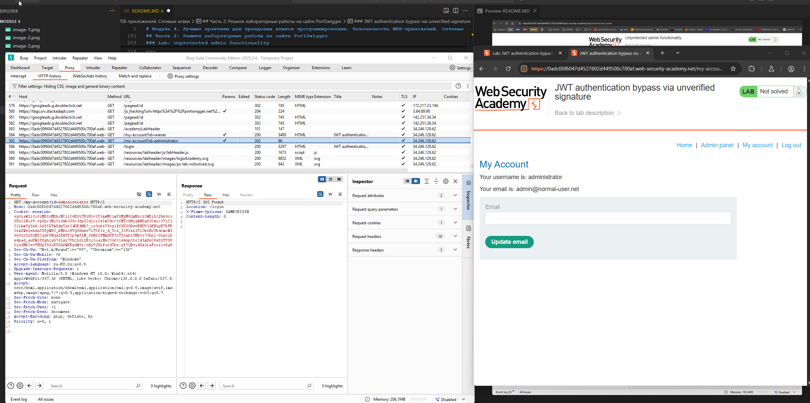

В результате с полученным JWT-токеном мы попадаем в личный кабинет пользователя с рашширенными правами администратора и получаем доступ к доп. пункту меню **Admin panel**

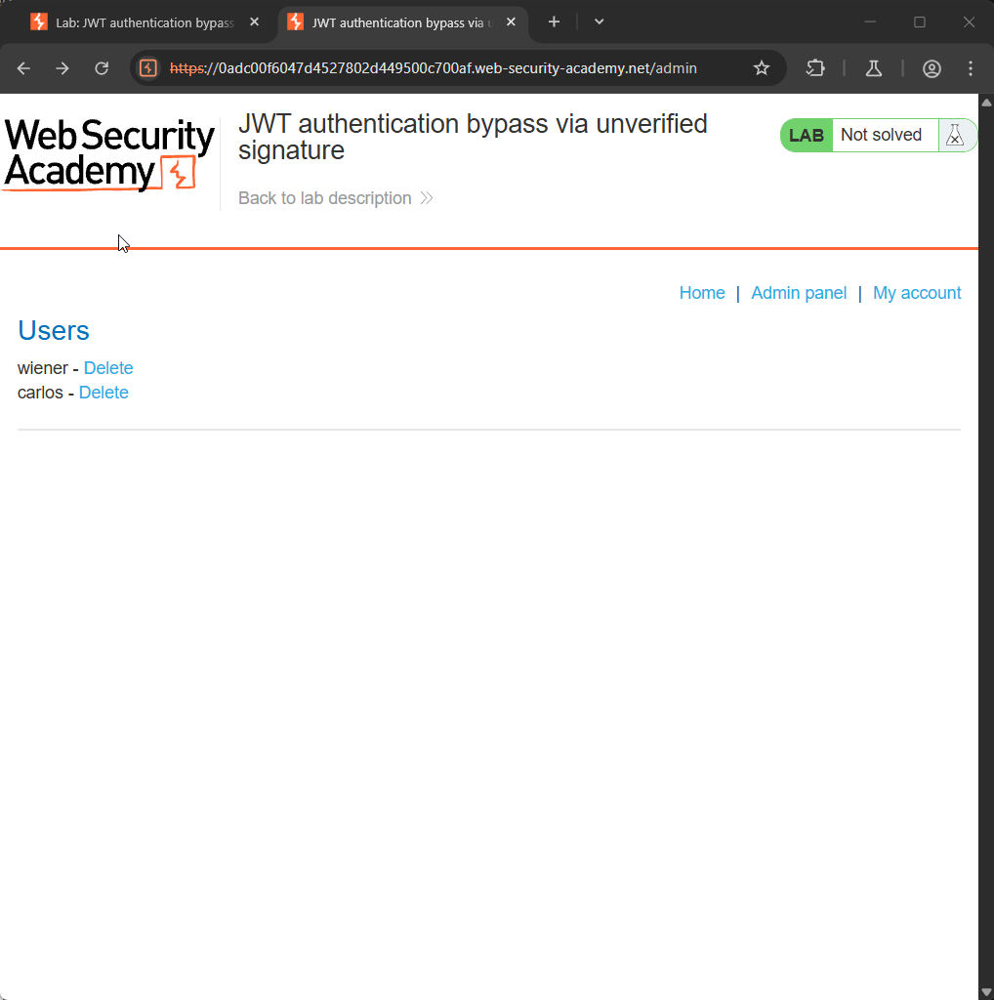

Удаляем нужную учетную запись (запрос отправляется с тем же подмененным токеном, иначе не пройдет)
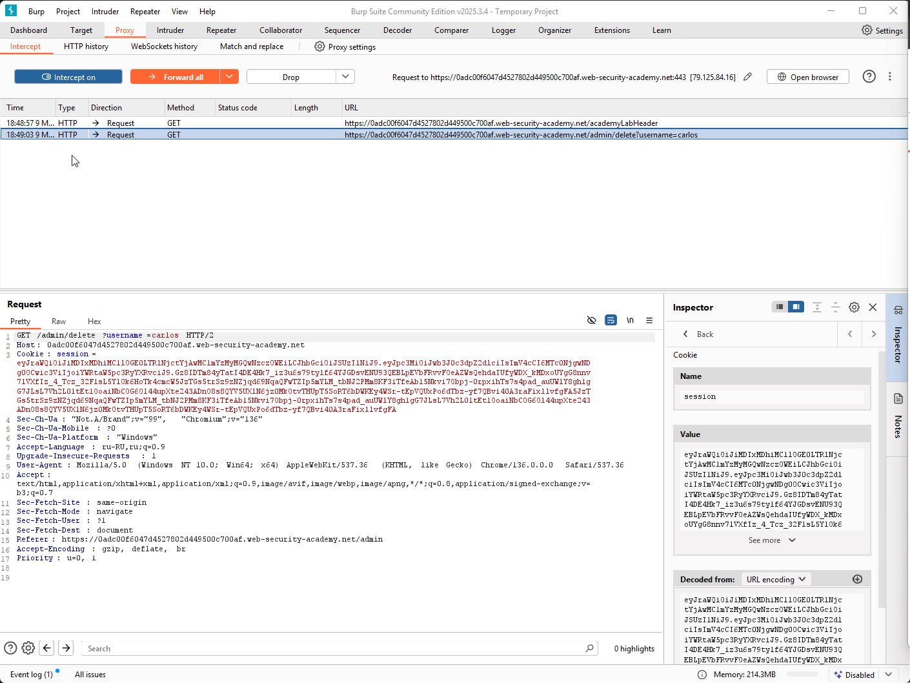

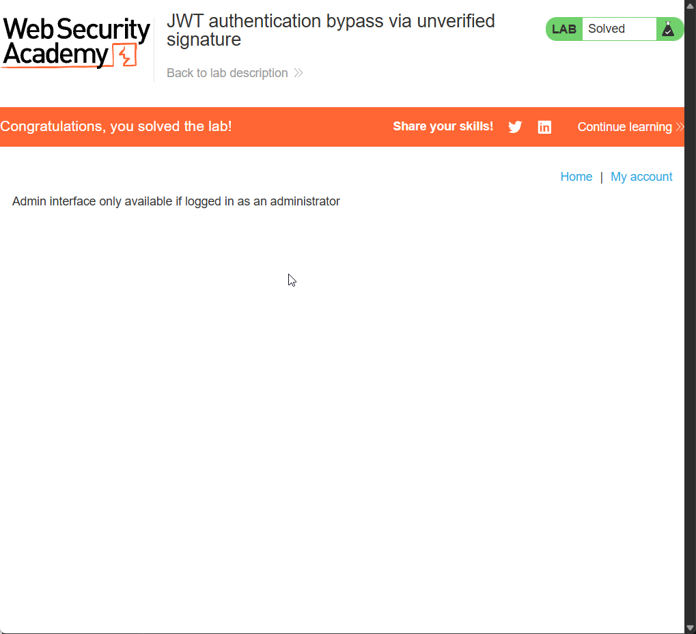

---

### Insecure direct object references

Тут все просто.

Через network inspector в хроме - смотрим какая ссылка генерируется для скачивания текстового файла.

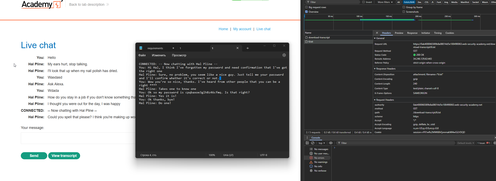

Обращаем внимание, что при скачивании файла был пропущен 1.txt - наверное это то, что нам надо!

Скачиваем файл 1.txt и смотрим его содержимое. В его содержимом видим переписку, в которой упоминается искомый пароль.

Пробуем...
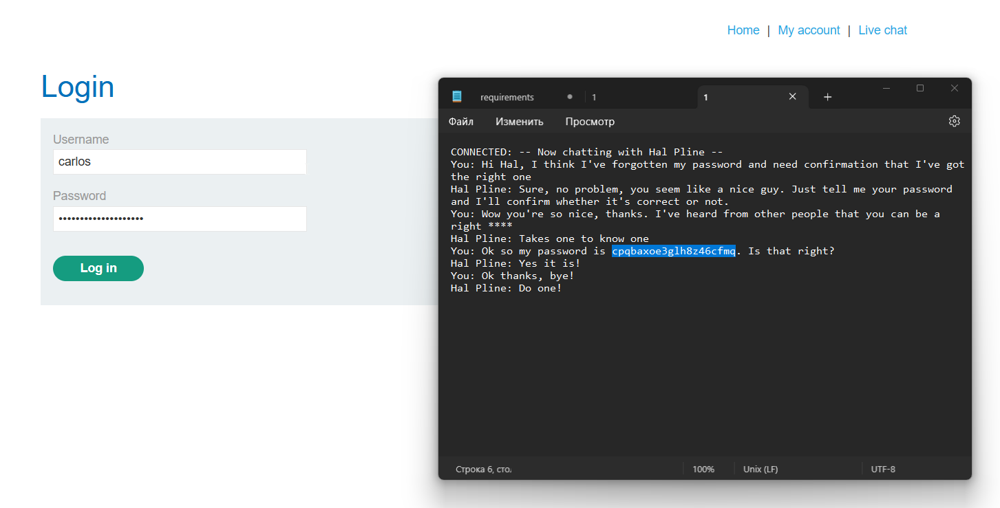


Успех!
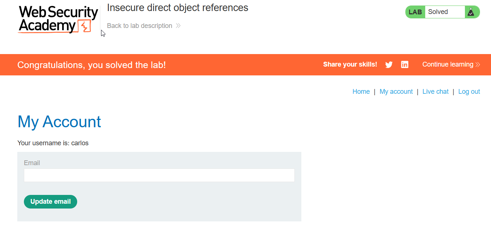