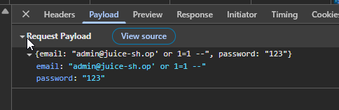
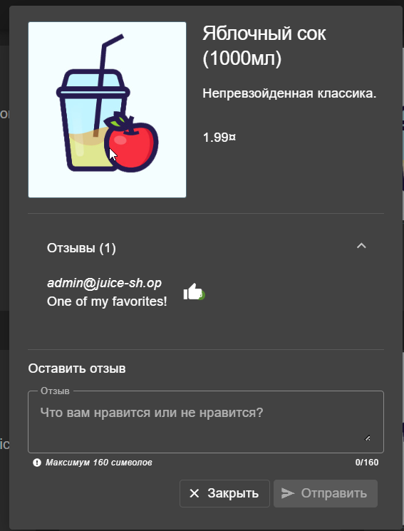
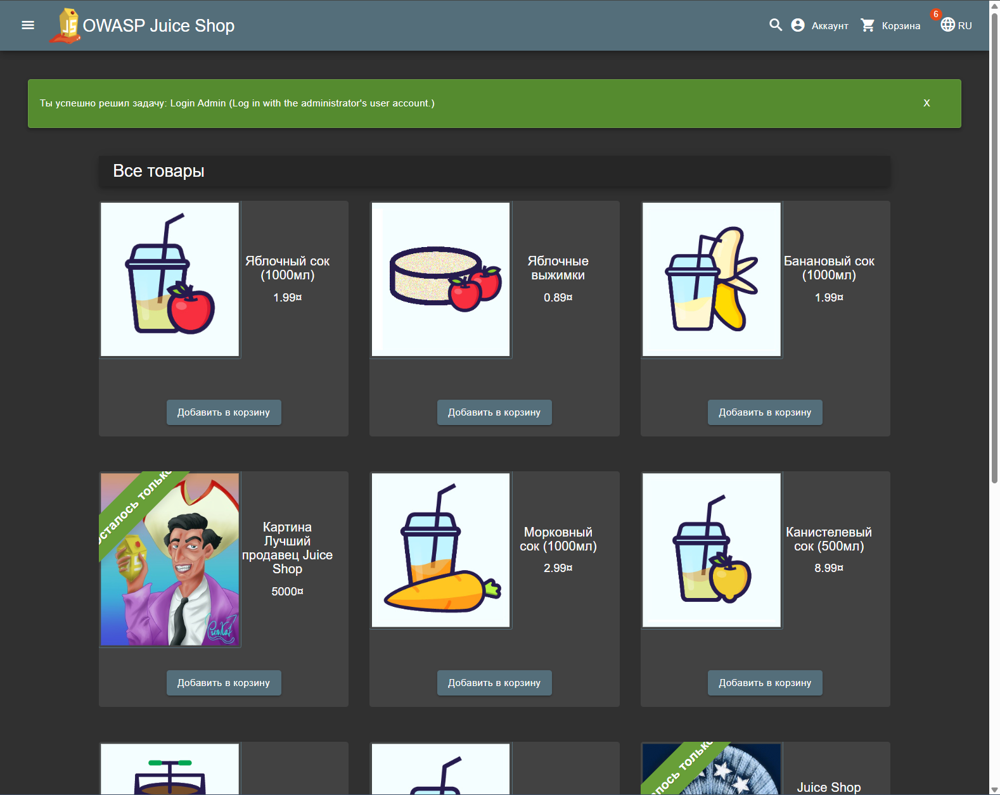
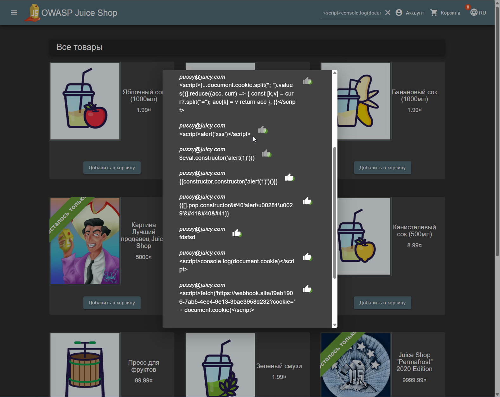
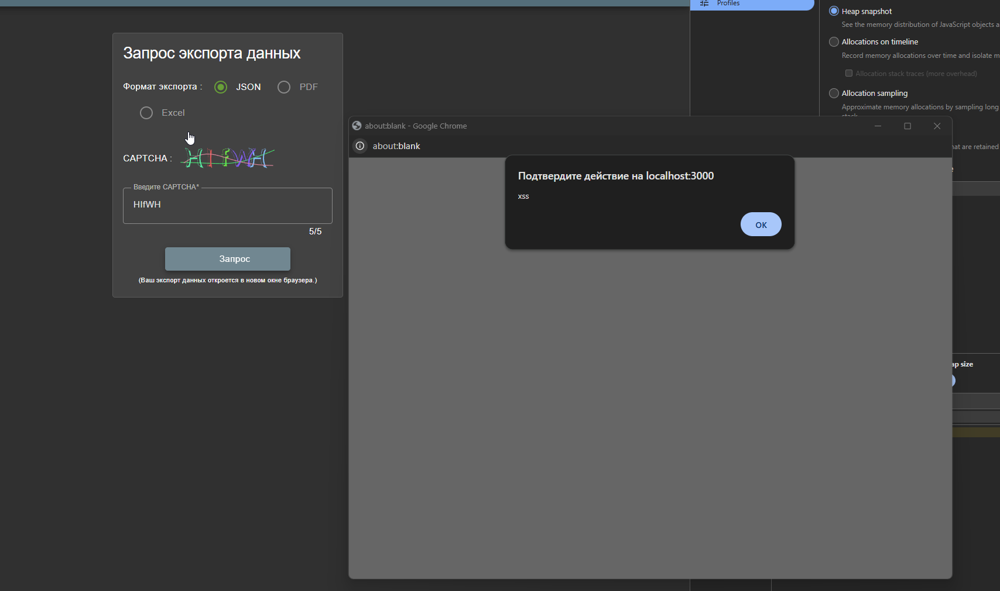
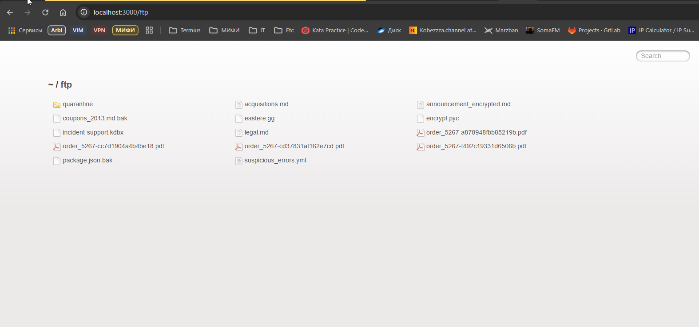
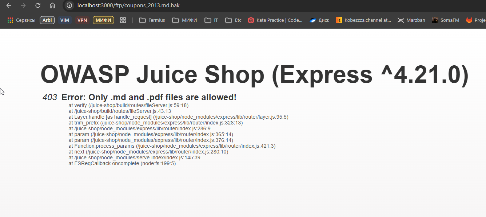
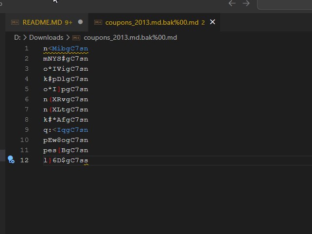
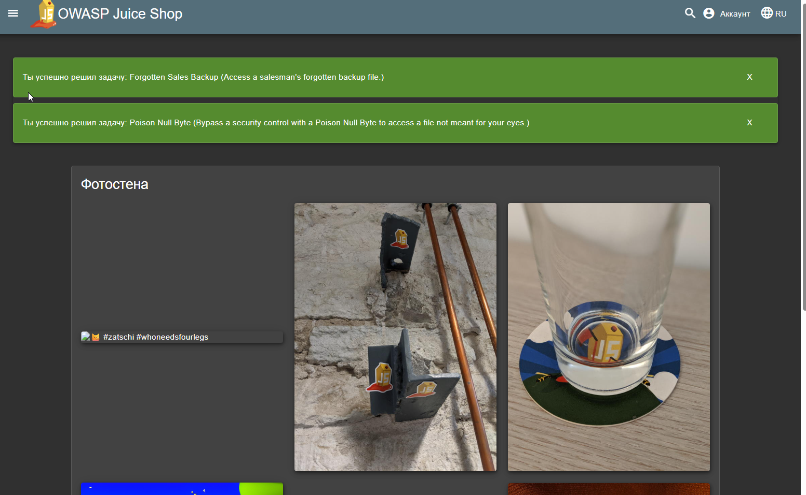

# Модуль 5. Аудит, пентест и современные методы выявления уязвимостей

## SQL Injection‑логин — войдите без регистрации, обойдя форму через SQL‑инъекцию

### Что было сделано

Была реализована атака через SQL-инъекцию в форме авторизации пользователя через поле логина

### Какой запрос/payload использовался и почему

Для реализации SQL атаки был использован стандартный шаблон SQL-инъекции, который закрывает текущее выражение, добавляет truthy-условие и ставит символ комментирования далее, таким образом, чтобы последующая часть SQL -запроса не была выполнена.

### Как была найдена уязвимость

В форме отзывов в одном из товаров был обнаружен потенциальный email админа.

Форма ввода пароля - идеальное место для SQL-атак.

Успешная реализация SQL-инъекции:

### Как можно защититься от данной уязвимости

Использовать стандартные практики защиты от SQL-инъекций - экранирование ввода

### Какие риски несет данная уязвимость

В данном случае уязвимость позволяет получить админский доступ к сервису, что является критичным

---

## Stored XSS — внедрите скрипт, получите cookie/JWT admin‑учетки и подтвердите захват сессии.

### Что было сделано

Была реализована атака Stored XSS, при которой мы сохранили вредоносный js код, хранящийся в БД и исполняемый при рендере определенной страницы

### Как была найдена уязвимость

Для реализации атаки использовалось поле ввода отзывов в приложении, где сперва вводились различные варианты XSS инъекций. 

Далее оставалось найти место, где данная уязвимость эксплуатировалась.
Оно было найдено в функционале экспорта данных 

Далее остается только сформировать необходимый payload для атаки, которая позволила бы получить ценную информацию со стороны другого пользователя (целимся на админа).

Был использован сторонний сервис https://webhook.site - на который отправляется запрос, содержащий данные о куках пользователя.

Далее остается только дождаться, когда целевой пользователь запросит экспорт данных и стригеррит выполнение уязвимого кода...

### Как можно защититься от данной уязвимости

- Экранировать HTML-вывод — особенно переменные, вставляемые в HTML, JS, атрибуты.

- Использовать Content Security Policy (CSP) — запретить выполнение встроенных скриптов.

- Валидация и фильтрация входных данных — удалять потенциально опасные теги 

---

## Administration Access

## Backup & Crack

Если попробовать подставить в путь сервиса /ftp, то откроется незакрытый путь в ftp серверу:

Пробуем скачать coupons_2013.md.bak - ошибка, можно скачать только MD и PDF

Пробуем эксплуатировать null byte уязвимость, подставив ``%2500.md`` в конце:

Файл успешно скачался!

