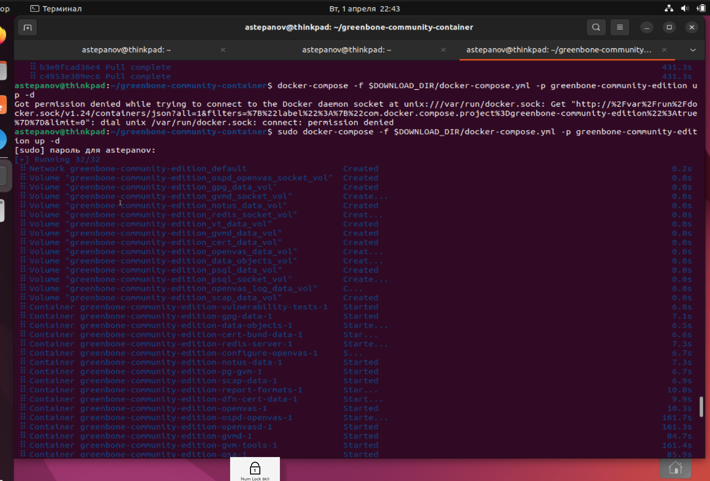
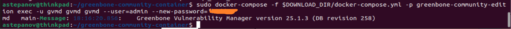
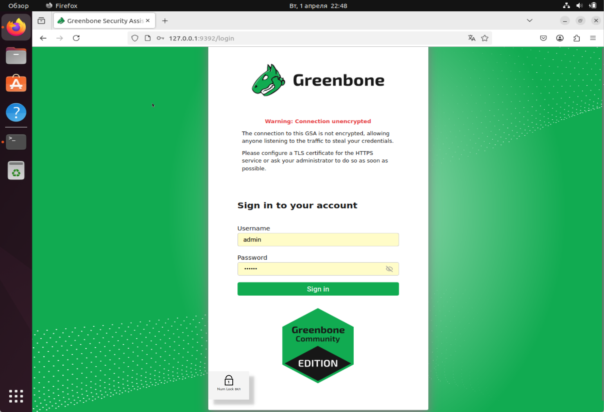
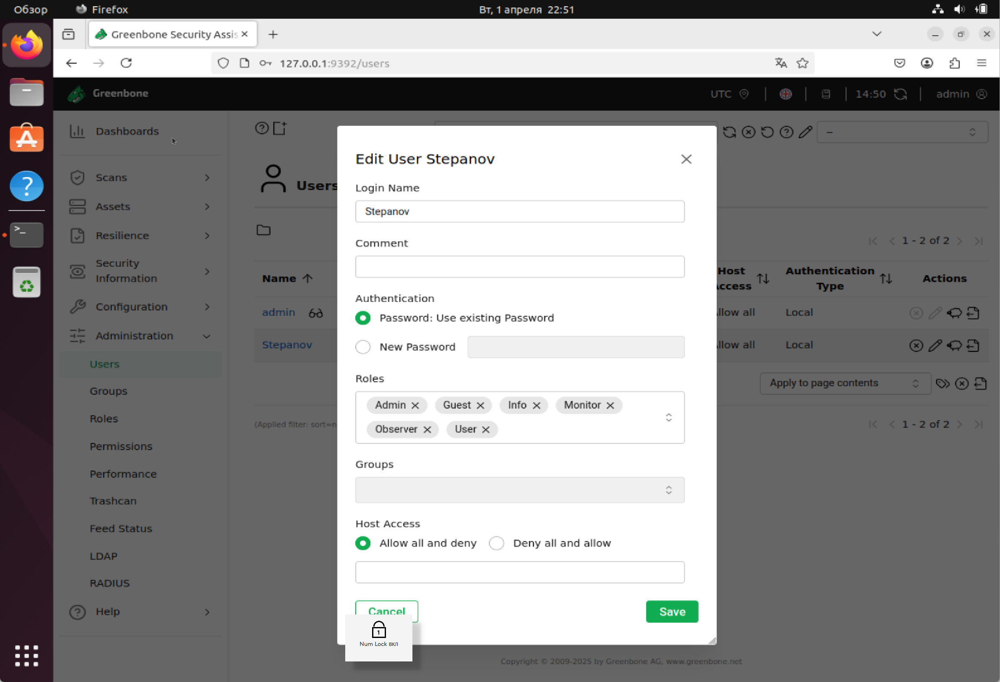
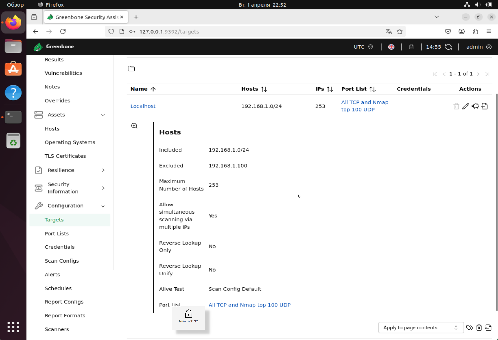
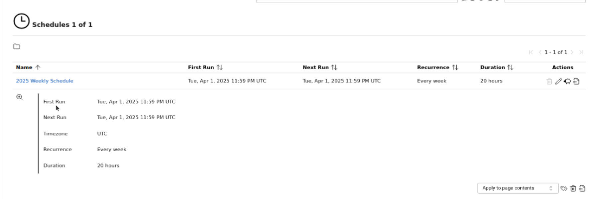
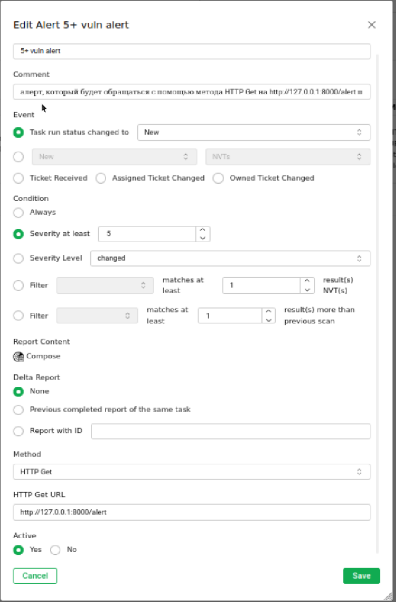
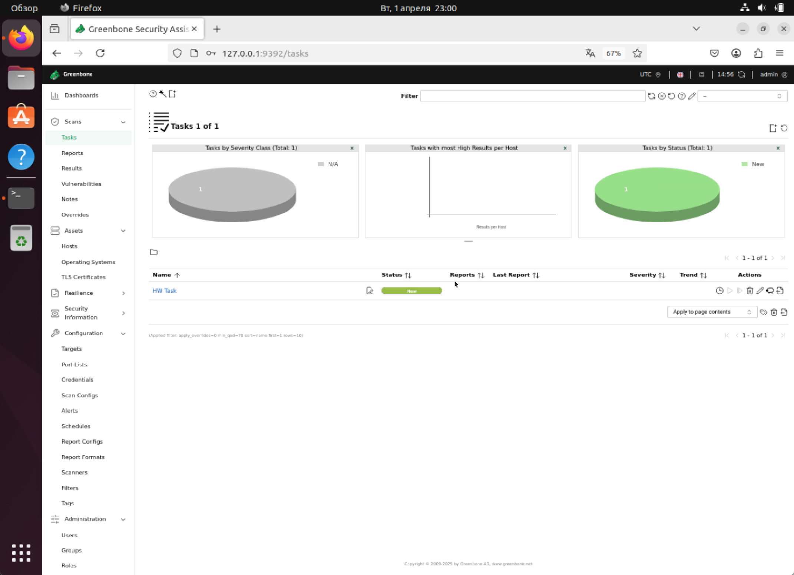

# Модуль 2. Сканирование на уязвимости. Сетевые сканирования (vo_HW)

## Задание №2. Сканирование с помощью OpenVAS

### Шаг 1. Установка OpenVAS.

Устанавливаем OpenVas на виртуальной машине Ubuntu, следуя инструкции из урока по OpenVas в данном модуле

1. Устанавливаем **docker**, **docker-compose**, скачиваем нужный docker-контейнер (**greenbone-community-edition**)

2. Запускаем контейнер в режиме демона

3. Задаем пароль для админской учетной записи

4. Заходим в web-интерфейс развернутного приложения под учеткой **admin**

### Шаг 2. Создать пользователя

Создаем пользователя Stepanov

### Шаг 3. Настроить новый список для сканирования

Создаем новый список для сканирования согласно требованию в задании

### Шаг 4. Создать новый таск на сканирование
Создаем новую задачу на сканирование под названием **HW Task**

Внутри задачи создаем новое расписание по которому будем производить проверку на уязвимости в течение следующего года под названием **2025 Weekly Schedule**

### Шаг 5. Создать алерт, который будет обращаться с помощью метода HTTP Get на http://127.0.0.1:8000/alert при появлении уязвимости с уровнем критичности >5.0
Создаем алерт **"5+ vuln alert"** согласно заданию и устанавливаем его в нашей задаче.

### Шаг 6. Сохранить таск

Страница с сохраненным таском
