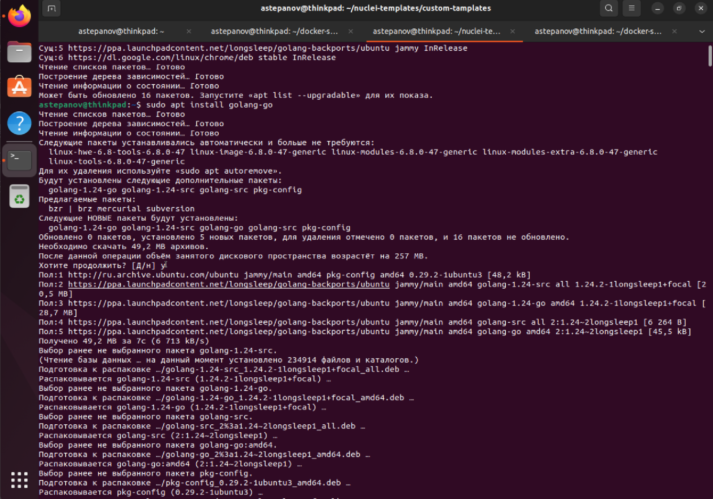
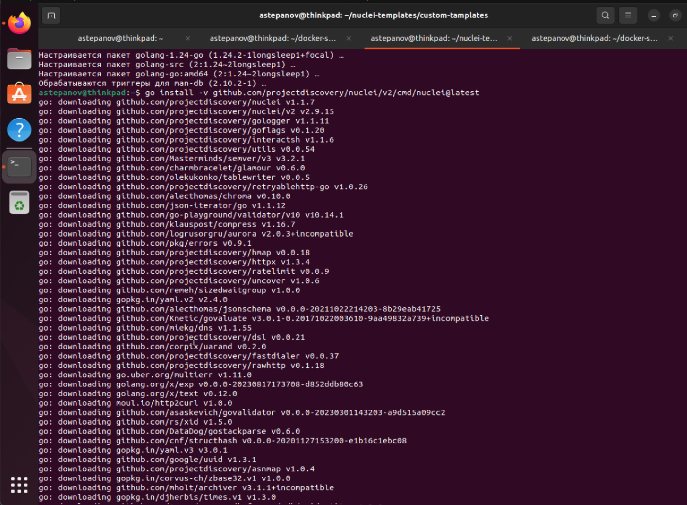
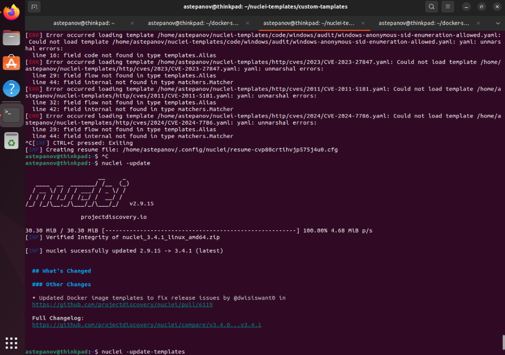
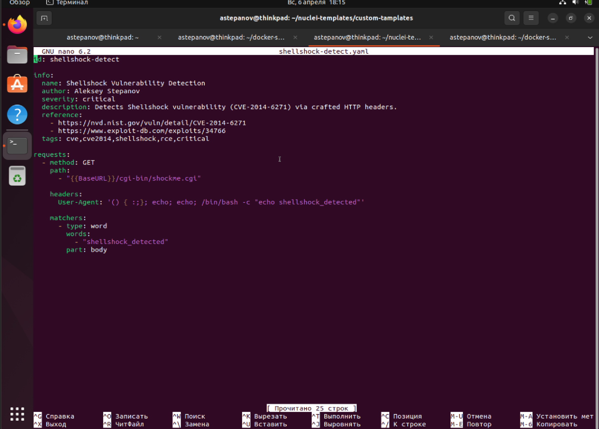
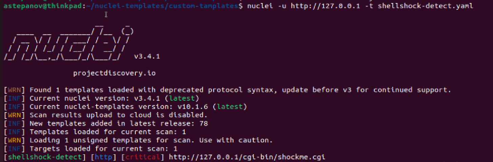

# Модуль 3.Сканирование приложений на уязвимости (vo_HW)

## Задание № 3.1. Детектирование Shellshock с помощью Nuclei

### Установка Nuclei.

Устанавливаем nuclei на виртуальную машину Ubuntu.

Для начала устанавливаем **golang**:


После установки **golang** производим установку nuclei из **github** репозитория:


После установки nuclei - обновим её до последней версии...


### Подготовка шаблона для детектирования уязвимости Shellshock

Создаем скрипт для детектирования уязвимости Shellshock


Данный скрипт настроен на конкретный проверку cgi-скрипта, доступного в репозитории [docker-shellshockable](https://github.com/Zenithar/docker-shellshockable).

### Описание шаблона

Этот шаблон предназначен для обнаружения уязвимости Shellshock (CVE-2014-6271) — одной из критических уязвимостей, позволяющей удалённое выполнение произвольных команд на сервере, если он использует Bash и обрабатывает HTTP-заголовки в CGI-скриптах.

1. Шаблон отправляет HTTP GET-запросы на указанный в шаблоне cgi-скрипт. В запросе он подставляет вредоносный заголовок User-Agent, специально сконструированный для проверки на Shellshock:

    ```bash
    User-Agent: () { :;}; echo; echo; /bin/bash -c "echo shellshock_detected"
    ```

    Это строка использует особенность Bash: если интерпретатор увидит такую функцию в окружении **() { :;}**, он выполнит всё, что идёт после. Таким образом, выполняется команда **echo shellshock_detected**.

2. Смотрит на тело ответа от сервера и пытается найти строку
    Если эта строка присутствует — значит удалённая команда выполнилась, и сервер уязвим к Shellshock.

⚠️ Для тестирования работы nuclei-шаблона этого достаточно, однако, в реальности лучше усовершенствовать шаблон таким образом, чтобы он позволял автоматически находить доступные cgi-скрипты и тестировать уязвимость на них, либо передавать в шаблоне в **requsets.path** список наиболее распространенных путей до cgi-скриптов.

### Примеры запуска и демонстрация

Запускаем **nuclei**, передавая адрес проверяемого хоста (в нашем случае [docker-shellshockable](https://github.com/Zenithar/docker-shellshockable) запущен локально на хосте **127.0.0.1**), с опцией **-u** и передавая шаблон для проверки (**shellshock-detect.yaml**) через опцию **-t**.



В результате проверки **nuclei** выдает строчку **[shellshock detect]**, с указанием степени критичности уязвимости (**critical**), что свидетельствует о том, что скрипт успешно отработал.
