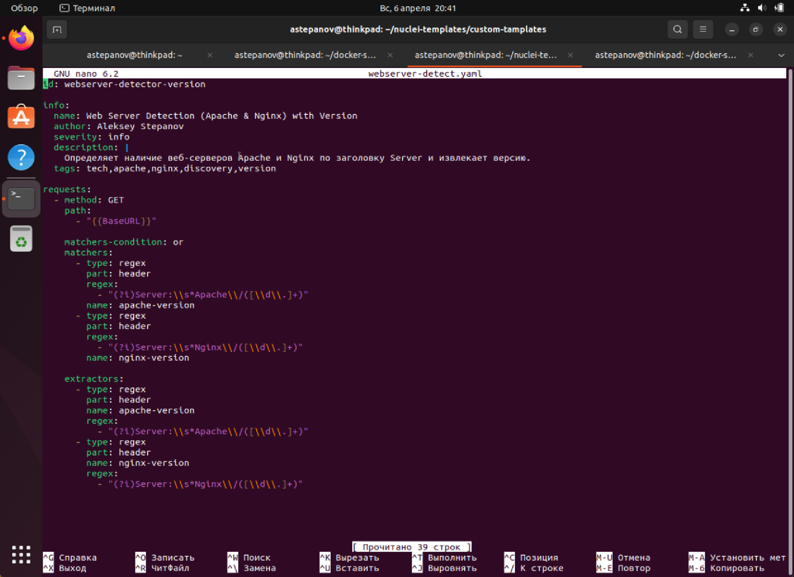
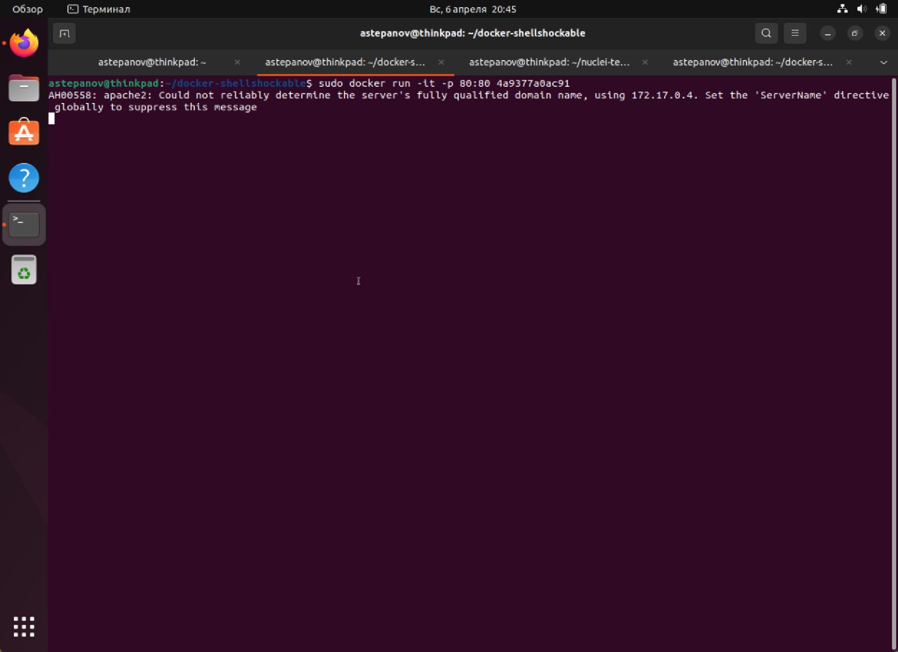
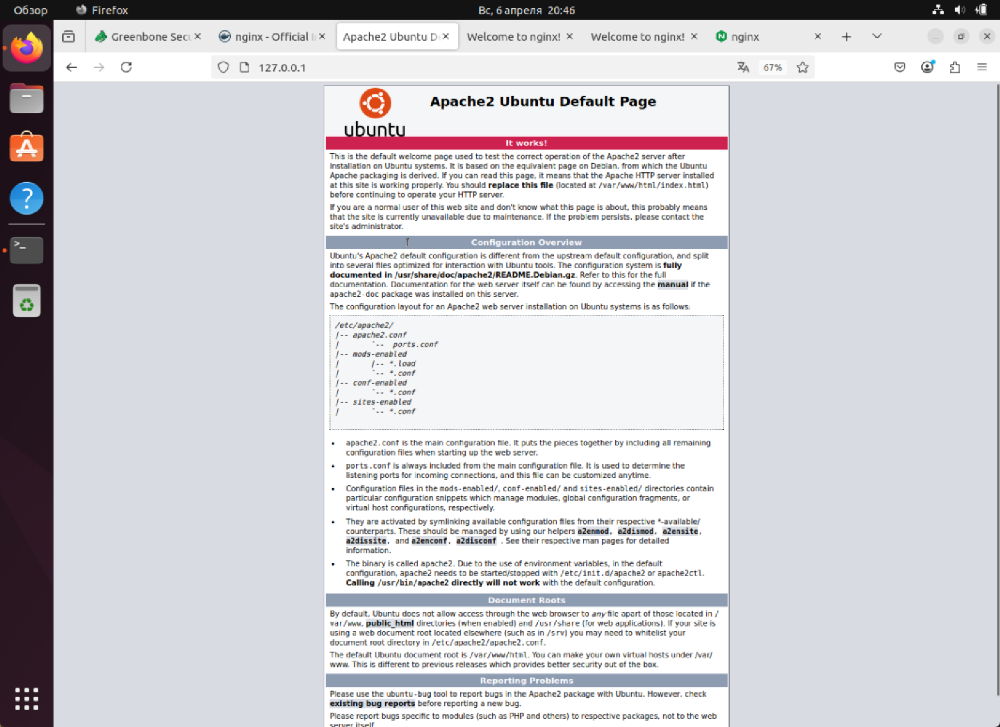
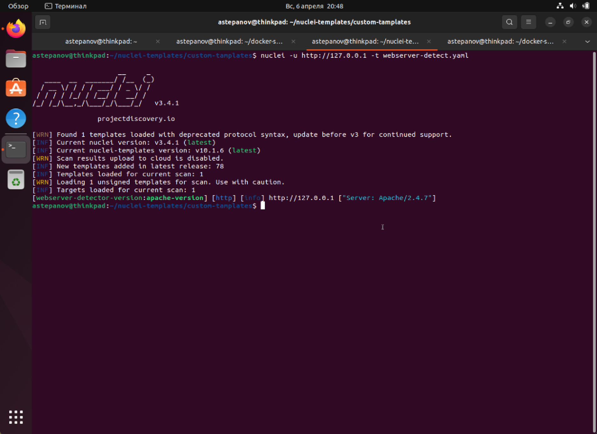
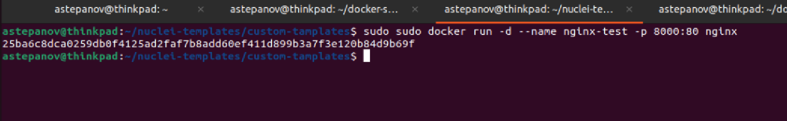
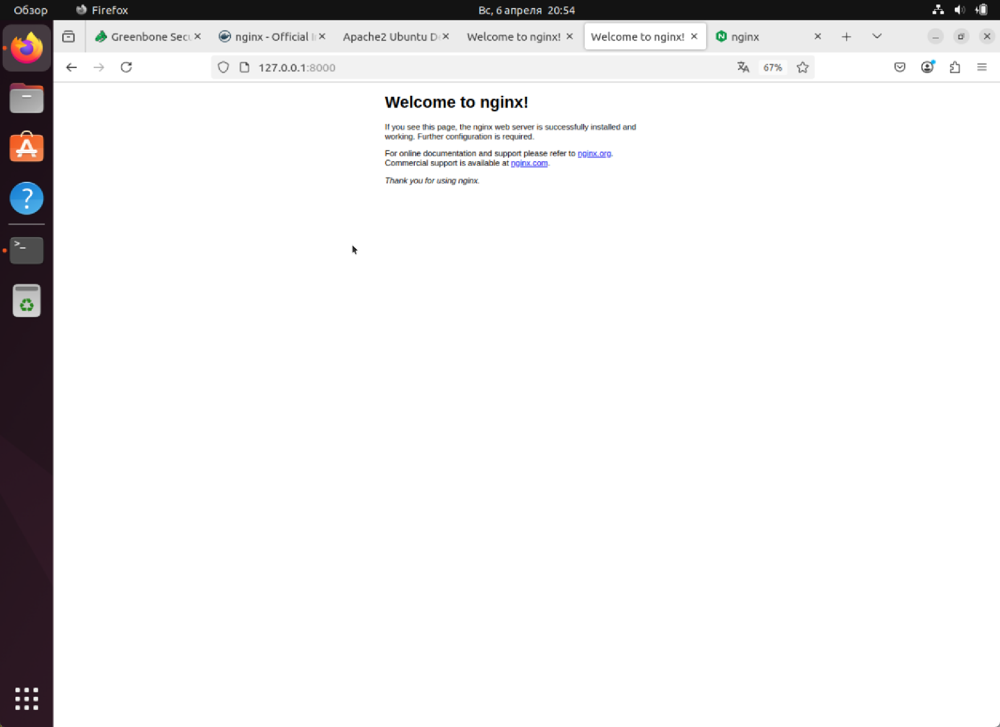
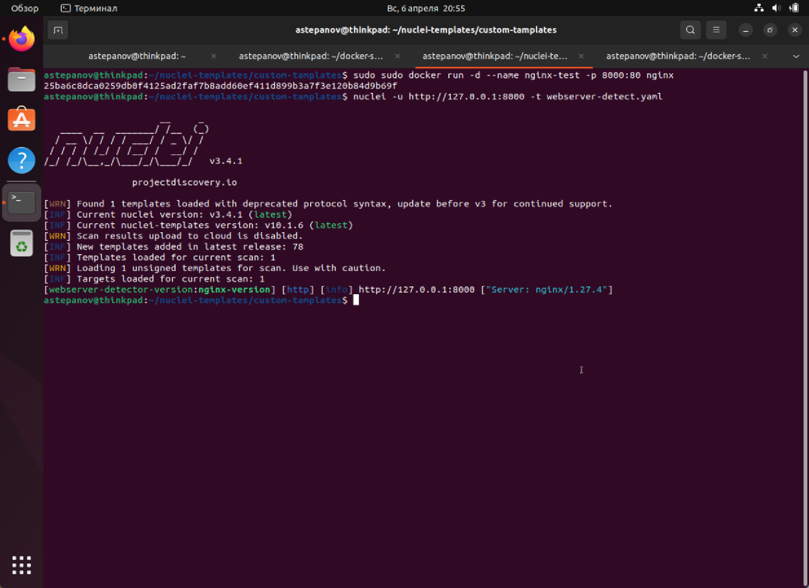

# Модуль 3.Сканирование приложений на уязвимости (vo_HW)

## Задание № 3.2.Детектирование заголовков с помощью Nuclei

### Шаблон nuclei для детектирования серверов Apache и Nginx и их версий:



### Описание работы шаблона:
Шаблон для Nuclei, предназначенный для детектирования версий веб-серверов Apache и Nginx, отправляет HTTP-запрос на целевой сервер и анализирует его ответ, обращая внимание на заголовок "Server". В зависимости от содержимого этого заголовка, шаблон проверяет, является ли сервер Apache или Nginx, а также извлекает информацию о версии сервера. Регулярные выражения ищут строки, которые содержат информацию о версии сервера, например, "Apache/2.4.41" или "Nginx/1.18.0". Если в заголовке присутствуют такие данные, шаблон извлекает номер версии веб-сервера и помечает его как результат. Шаблон использует два регулярных выражения для каждой из платформ — для Apache и для Nginx. Это позволяет детектировать как сам сервер, так и его версию, предоставляя информацию о целевом сервере в случае успешного нахождения совпадений.

### Примеры запуска и демонстрация

#### Проверка на сервере Apache. 
Для проверки на сервере Apache используем ранее установленный в docker-е уязвимы Apache-сервер из репозитория [Zenithar/docker-shellshockable](https://github.com/Zenithar/docker-shellshockable). Для данных целей он вполне подойдет.

**Запускаем докер контейнер с apache-сервером и прокидываем его на 80-ый стандартный http порт**



**Видим что сервер работает на стандартном http-порте на localhost'e**



Проверяем как будет задетектирован наш веб серевер с помощью нашего nuclei-шаблона:


Видим, что nuclei успешно опредилил веб-сервер apache, в.т.ч его версию

#### Проверка на сервере Nginx.
Для проверки детектирования сервера nginx, запустим сервер nginx прямо из docker-образа, прокинув его на произвольный 8000-ый порт:


Проверяем, что nginx запустился и работает на нужном порте:


Проверяем работу nuclei-шаблона на нашем хосте:


Видим, что nuclei так же успешно опредилил веб-сервер nginx и его версию!

```yaml
id: airflow-api-default-login

info:
    name: Apache Airflow API - Default Logins
    author: Pavel Parkhomets
    severity: critical
    tags: api,airflow,default-login,bruite-force

requests:
  - method: GET
    path:
      - "{{BaseUrl}}/api/v1/dags"
    headers:
        Authorization: "Basic {{base64(username + ':' + password)}}"
        Content-Type: applixation/json
    payloads:
        username:
            - "airflow"
            - "admin"
        password:
            - "airflow"
            - "admin"
        attack: clusterbomb
        matchers-condition: and
        matcher:
          - type: word
            words:
              - "dag_id"
          - type: word
            words:
             - "kafka_server_sockerservermetrics_successful_reauthentication_rate"
               part: body
            negative: true
        stop-at-first-match: true
```