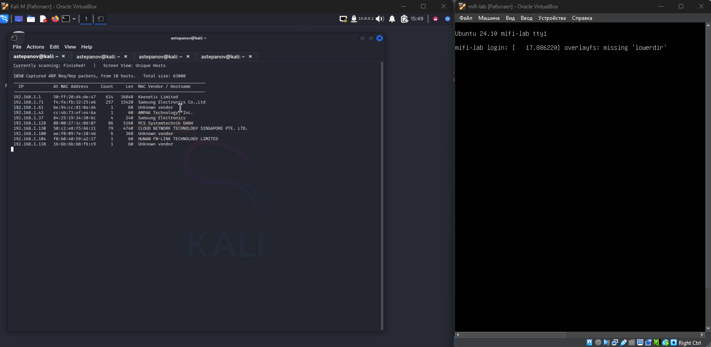
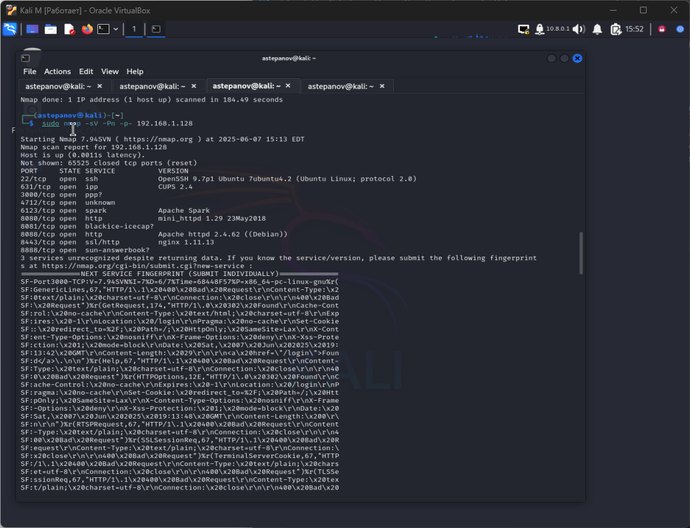
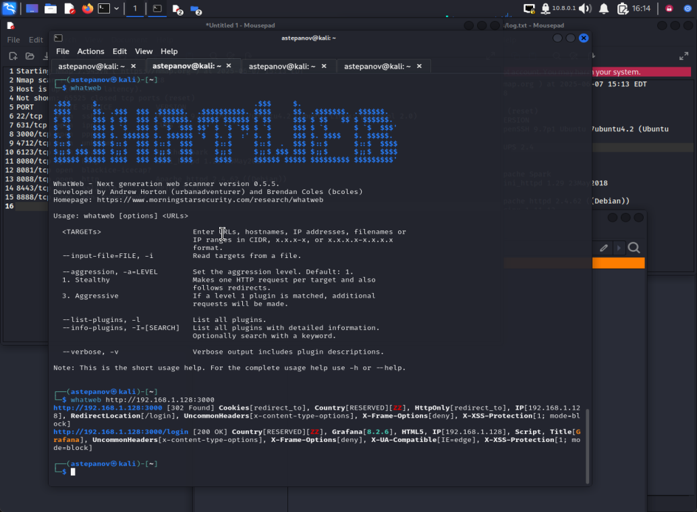
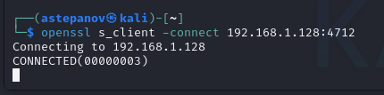
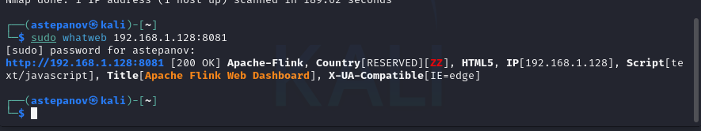
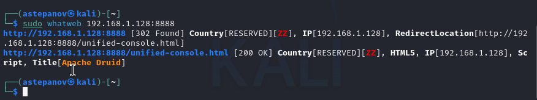
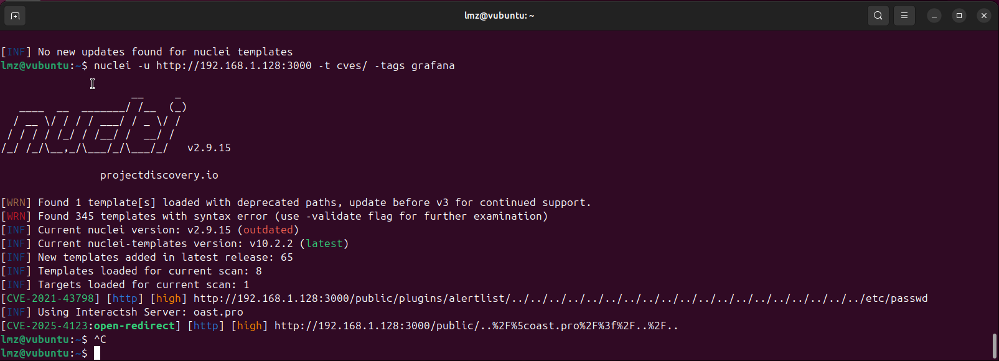
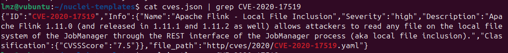
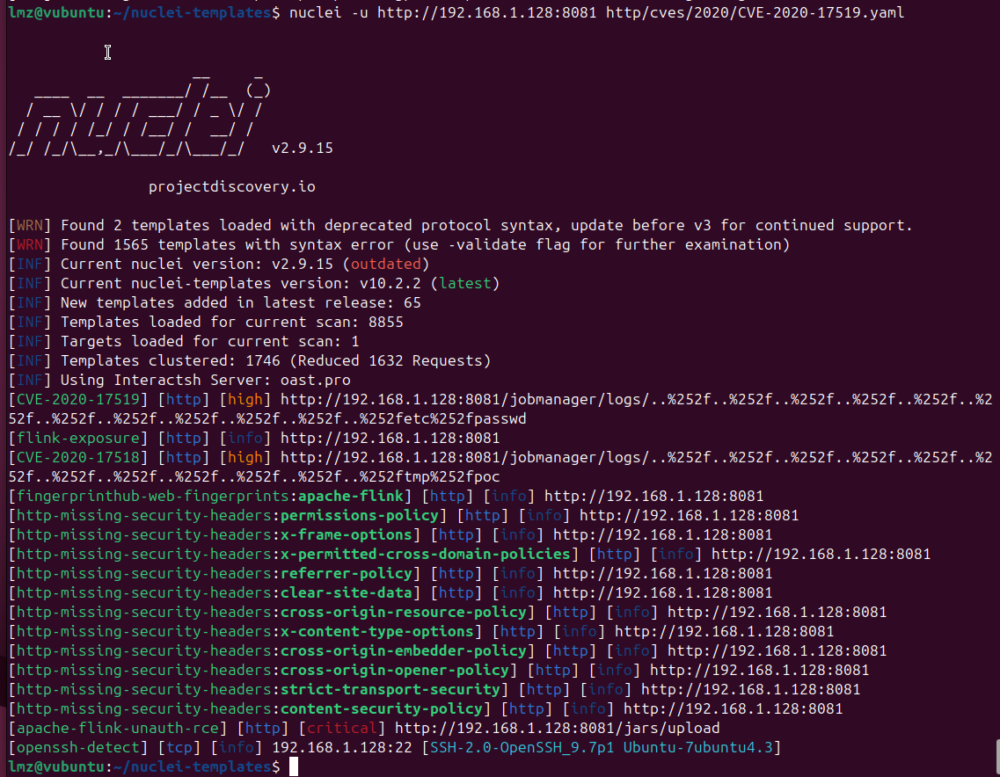

# Выявление уязвимостей. Практика

# Часть 1

### Запуск виртуальной машины с заданием

Запускаем виртуальную машину с заданием, а так как же виртуальную машину с Kali Linux для сканирования в режиме bridge
Сканируем сеть с помощью netdiscover для определения ip-адреса машины с заданием. 

В нашем случае это хост с адресом `192.168.1.128`

### Определение открытых портов и сервисов

Запускаем сканирование целевого адреса хоста `192.168.1.128`
Для сканирования используем команду
`sudo nmap -sV -Pn -p- 192.168.1.128`, данная команда выполняет полное сканирование всех TCP-портов на хосте `192.168.1.128` с попыткой определить версии сервисов, даже если хост не отвечает на ping-запросы

### Список открытых портов и сервисов

| Порт     | Состояние | Сервис         | Версия                                      | Комментарий | 
|----------|-------|-----------------|----------------------------------------------|------|
| 22/tcp   | open  | ssh             | OpenSSH 9.7p1 Ubuntu 7ubuntu4.2 (Ubuntu Linux; protocol 2.0) |SSH порт|
| 631/tcp  | open  | ipp             | CUPS 2.4                                     | Протокол межсетевой печати |
| 3000/tcp | open  | ppp?            | Grafana 8.2.6                                | Point-to-Point протокол, nmap не уверен в результате, требует дополнительного анализа
| 4712/tcp | open  | unknown         |                                              | 
| 6123/tcp | open  | spark           | Apache Spark                                 |
| 8080/tcp | open  | http            | mini_httpd 1.29 23May2018                    |
| 8081/tcp | open  | blackice-icecap?| Apache Flink 1.11.2                         |
| 8088/tcp | open  | http            | Apache httpd 2.4.62 ((Debian))               |
| 8443/tcp | open  | ssl/http        | nginx 1.11.13                                |
| 8888/tcp | open  | sun-answerbook? | Apache Druid                                  |

### Проверка неопределенных сервисов

`3000/tcp` - для определения сервиса использовал консольную утилиту `whatweb`, на 3000 порту работает `Grafana`

`4712/tcp` - порт не поддался ни глубокому скану, ни тихому, ни агрессивному. На данному порту нет никакого веб-сервиса, однако с ним удается установить SSL-соединение. Видимо на данном порту находится какой-то внутренний зашифрованный сервис.

`8081/tcp` -для определения сервиса использовал консольную утилиту `whatweb`, на данном порту работает сервис `Apache Flink`, версия 1.11.2 (можно увидеть через веб-интерфейс)

`8888/tcp` -для определения сервиса использовал консольную утилиту `whatweb`, на данном порту работает сервис `Apache Druid`

# Часть 2

! Вторую часть выполнял с другой виртуальной машины (Ubuntu), так как были проблемы с доступностью репозиториев Kali и установкой Nuclei

### 1. Сервис Grafana 8.2.6 
Содержит ряд уязвимостей, которые можно определить по версии сервиса, найдя их в общедоступных базах уязвимостей. Например вот тут:
https://www.cybersecurity-help.cz/vdb/grafana_labs/grafana/8.2.6/

Видим, что данная версия Графаны потенциально содержит ряд уязвимостей, в том числе высокого уровня.

**Path traversal (CVE-2021-43798)**

#### Уровень риска: 7.5 HIGH

#### Суть уязвимости:
Уязвимость позволяет удалённому злоумышленнику выполнить атаку типа обхода директорий (directory traversal).
Уязвимость возникает из-за ошибки проверки вводимых данных при обработке последовательностей обхода директорий, переданных после пути /public/plugins/ в URL.

### Потенциальные последствия:
Удалённый неаутентифицированный атакующий может отправить специально сформированный HTTP-запрос и получить доступ к произвольным файлам в системе.

### Детектирование с помощью Nuclei
Для детектирования уязвимостей, специфичных для сервиса Графана используем шаблоны с тегом `grafana`

В результате найдено 2 уязвимости высокого (HIGH) уровня:

**Path traversal in Grafana** (описана выше)

https://nvd.nist.gov/vuln/detail/CVE-2021-43798

**A cross-site scripting (XSS) vulnerability** (свежая, 2025 года)

https://nvd.nist.gov/vuln/detail/CVE-2025-4123 

#### Уровень риска: 7.6 HIGH

#### Суть уязвимости:
Это уязвимость высокой степени в Grafana, сочетающая в себе path traversal и open redirect, что приводит к хранимому XSS (Stored Cross-Site Scripting) в клиентской части. Уязвимость не требует прав авторизации — достаточно включённого анонимного доступа.

При установленном плагине Grafana Image Renderer open redirect может эскалировать до полноценного SSRF (server-side request forgery), позволяя читать внутренние ресурсы, включая cloud-metadata сервисы.

### Потенциальные последствия:
 - XSS в браузере жертвы
— злоумышленник перенаправляет пользователя на сайт с вредоносным плагином и исполняет JavaScript в контексте доверенного домена Grafana. Возможности: кража сессий, привилегий, выдача себя за администратора.

- Угон аккаунта и привилегий — с помощью кражи куки или токенов можно получить контроль над аккаунтом Grafana, а далее изменить настройки, подключить новые data-source, плагины, оповещения.

- SSRF и доступ к внутренним сервисам — при наличии Image Renderer, open redirect трансформируется в SSRF, что обнажает внутренние API и cloud-metadata (например AWS IAM-креденшалы)

- Распространение в инфраструктуре - Grafana часто имеет доступ к множеству систем (Prometheus, Loki, Kubernetes, базы и т.д.). Угон аккаунта или SSRF может раскрыть данные других сервисов и стать точкой для распространения.

- Снижение доверия и регуляторные риски — компрометация dashboard, раскрытие учетных данных или внутренних метрик — может привести к серьёзному репутационному и юридическому ущербу

### 2. Сервис Apache Flink 1.11.2
Информация по уязвимостям сервиса доступна на официальном сайте:

https://flink.apache.org/what-is-flink/security/

### Версия 1.11.2 содержит 2 схожих уязвимости:

### **Apache Flink directory traversal**: удалённая запись файлов через REST API.
[CVE-2020-17518](https://cve.mitre.org/cgi-bin/cvename.cgi?name=CVE-2020-17518)

**Уровень**: 7.5 HIGH

**Описание**:
Apache Flink 1.5.1 ввёл REST-обработчик, который позволяет записывать загруженный файл в произвольное место на локальной файловой системе с помощью специально модифицированного HTTP-заголовка. Файлы могут быть записаны в любое место, доступное для Flink 1.5.1. Всем пользователям рекомендуется обновиться до Flink версии 1.11.3 или 1.12.0, если экземпляры Flink находятся в открытом доступе.

###  Потенциальные последствия:
1. Утечка конфиденциальной информации
    Атакующий может прочитать:

    - Файлы конфигурации (с логинами, паролями, API-ключами);

    - SSH-ключи и сертификаты;

    - Системные логи (для анализа поведения и подготовки дальнейших атак);

    - Бизнес-данные, если они хранятся локально на машине JobManager.

2. Раскрытие структуры системы
    Из содержимого файлов (например, /etc/passwd, логов, конфигов) можно:

    - Узнать, какие службы работают;

    - Получить список пользователей;

    - Выяснить архитектуру системы и способы обхода защиты.

3. Упрощение последующих атак
    Злоумышленник может:

    - Использовать полученные конфиденциальные данные для авторизации в других системах;

    - Найти пути для повышения привилегий;

    - Получить информацию для дальнейших атак (например, по сети).

4. Компрометация приватных ключей.

    Если процесс JobManager имеет доступ к приватным ключам (например, для подключения к HDFS, базам данных, другим компонентам), утечка этих файлов может привести к полной компрометации кластера.

### **Apache Flink directory traversal attack**: удалённое чтение файлов через REST API.

[CVE-2020-17519](https://www.cve.org/CVERecord?id=CVE-2020-17519)

**Уровень**: 7.5 HIGH

**Описание**:
Изменение, введённое в Apache Flink 1.11.0 (и присутствующее также в версиях 1.11.1 и 1.11.2), позволяет атакующим читать любые файлы на локальной файловой системе JobManager через REST-интерфейс процесса JobManager. Доступ ограничен только теми файлами, к которым имеет доступ сам процесс JobManager.

### Потенциальные последствия:

1. Удалённое выполнение кода (RCE) - 
Атакующий может записать исполняемый скрипт (например, shell-скрипт или JAR-файл) в директорию, откуда он будет выполнен системой или администратором.

2. Получение доступа к системе - 
Если атакующий запишет SSH-ключ в ~/.ssh/authorized_keys пользователя Flink или root (если доступен), он может получить удалённый доступ к серверу.

3. Компрометация конфиденциальных данных - 
Можно записать файлы, подменяющие конфигурацию, или вмешаться в логи, чтобы скрыть следы.

4. Устойчивость (persistence) - 
Злоумышленник может оставить «бэкдор» — вредоносный скрипт или планировщик задач (cron), чтобы сохранять доступ после перезапуска системы.

5. Расширение атаки (lateral movement) -
Через этот сервер можно атаковать другие системы в локальной сети.

### Детектирование с помощью Nuclei

Для детектирования уязвимостей в сервисе **Apache Flink** воспользуемся поиском готовых шаблонов в nuclei-templates в файле **cves.json** по id CVE:

Видим, что одна из вышеперечисленных уязвимостей присутствует в cves.json, воспользуемся этим шаблоном для поиска уязвимостей в **Apache Flink**

Результат сканирования показал, что заявленные уязвимости обнаружены в сервисе, а так же обнаружена критическая уязвимость `apache-flink-unauth-rce`

### **Apache flink unauth rce**:

Удалённое выполнение кода без авторизации

URL: http://192.168.1.128:8081/jars/upload

**Уровень**: CRITICAL (CVE отсутствует)

**Описание**: Можно загрузить и запустить JAR-файл, что даёт полный контроль над сервером. RCE без авторизации — одна из самых опасных категорий уязвимостей. Flink по умолчанию не требует аутентификации на REST-интерфейсе, особенно в старых версиях.

###  Потенциальные последствия:
 - Полный захват сервера - Нападающий может загрузить JAR-файл с вредоносным кодом и выполнить его. Это может привести к установке backdoor, запуску криптомайнера, боту или RAT.

 - Доступ к данным - Возможность читать, изменять или удалять файлы на сервере.

 - Потенциальный доступ к конфиденциальной информации.

- Расширение атаки на внутреннюю сеть - Если Flink доступен из DMZ или LAN, злоумышленник может использовать машину как точку опоры (pivot) для проникновения глубже в инфраструктуру.

- Уничтожение или саботаж обработки данных - Flink — это система для обработки потоков данных; нарушив её работу, можно вызвать сбои в бизнес-логике, аналитике и автоматизации.

- Ущерб репутации и возможные регуляторные последствия. Особенно важно, если сервер содержит персональные данные.
