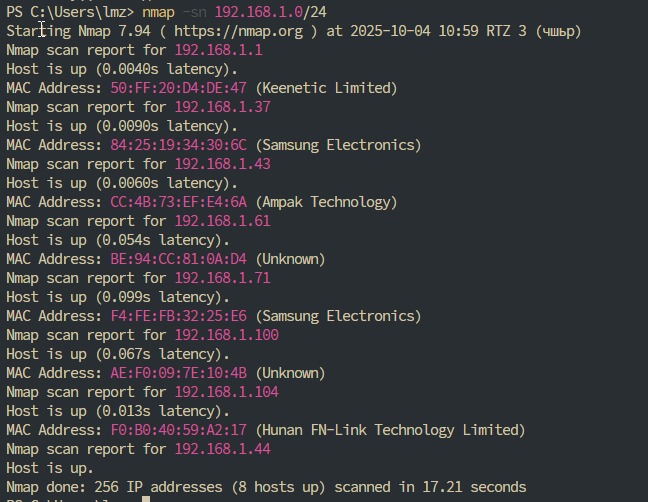
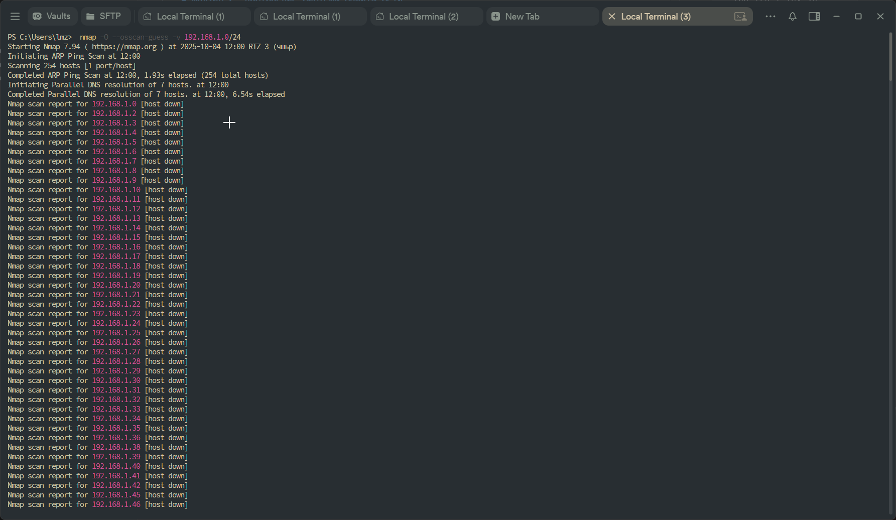
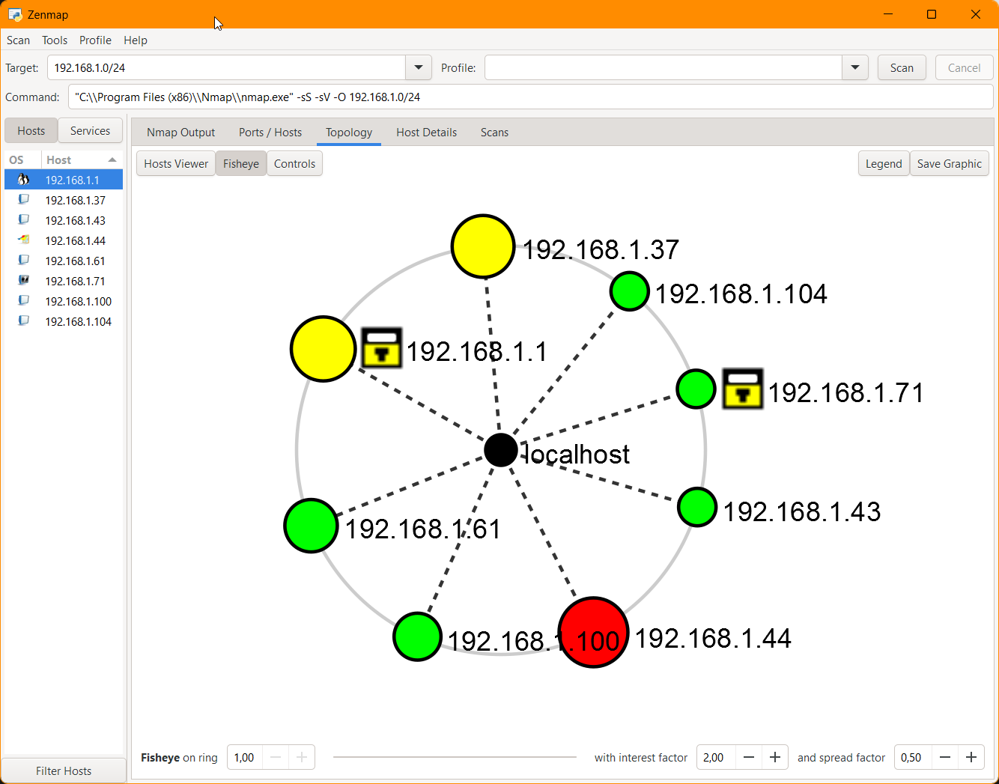

# Модуль 2. Построение системы защиты сети

## 1. Проведите сканирование домашней сети.
Сканируем локальную сеть 192.168.1.0 с помощью ping scan

```
nmap -sn 192.168.1.0/24
```




## 2. Обнаружьте все хосты, входящие в сеть.

Хосты входящие в сеть:

```
- 192.168.1.1 (Keenetic Limited)
- 192.168.1.37 (Samsung Electronics)
- 192.168.1.43 (Ampak Technology)
- 192.168.1.61 (Unknown)
- 192.168.1.71 (Samsung Electronics)
- 192.168.1.100 (Unknown)
- 192.168.1.104 (Hunan FN-Link Technology Limited)
- 192.168.1.44 (Unknown)
```

Если сопоставлять с данными о клиентах сети из интерфейса роутера, то nmap показал все.

## 3. Определите операционную систему всех устройств.
Определим ОС всех доступных хостов с помощью команды
```
  nmap -O --osscan-guess -v 192.168.1.0/24
```



| IP адрес        | Семейство ОС        | ОС (по версии Nmap)                           |
|-----------------|--------------------|-----------------------------------------------|
| 192.168.1.1     | Linux (Embedded)   | Linux 3.x–4.x (встроенная ОС роутера)         |
| 192.168.1.37    | HP Embedded        | HP embedded OS (LaserJet M451dn, CM1415fnw…)  |
| 192.168.1.43    | Embedded / Citrix  | Citrix / Juniper embedded                     |
| 192.168.1.44    | Windows            | Windows 10 / 11 / Server 2022 (99%)           |
| 192.168.1.61    | Apple (macOS/iOS)  | macOS 10.13–11 или iOS 12–13 (Darwin 19–20)   |
| 192.168.1.71    | Android / Tizen    | Не определено (возможно Android / Tizen)      |
| 192.168.1.100   | Apple (macOS/iOS)  | macOS 10.13–11 / iOS 12–13                    |
| 192.168.1.104   | Linux (Embedded)   | Linksys WRT610Nv3 / Citrix Access Gateway     |


## 4. Постройте топологию сети.
Топология сети была построена командой:

```
 nmap -sS -sV -O -oX topology_report.xml 192.168.1.0/24
```

с последующим сохранением отчета в файл `topology_report.xml`

Результат отображения топологии с помощью программы `Zenmap`




## 5. Обнаружьте открытые порты.
На основе отчета, сгенерированного в предыдущем пункте можно составить таблицу доступности портов:


| IP адрес        | Семейство ОС        | ОС (по версии Nmap)                           | Примечания / открытые порты |
|-----------------|--------------------|-----------------------------------------------|------------------------------|
| 192.168.1.1     | Linux (Embedded)   | Linux 3.x–4.x (встроенная ОС роутера)         | 23/telnet, 53/dns, 80/http, 443/https, 1900/upnp, 3517, 22 filtered |
| 192.168.1.37    | HP Embedded        | HP embedded OS (LaserJet M451dn, CM1415fnw…)  | 80/http, 515/printer, 631/ipp, 9100/jetdirect, 5200/targus-getdata |
| 192.168.1.43    | Embedded / Citrix  | Citrix / Juniper embedded                     | Все порты закрыты (возможно VPN шлюз или firewall) |
| 192.168.1.44    | Windows            | Windows 10 / 11 / Server 2022 (99%)           | 135/msrpc, 139/netbios, 445/smb, 443/https, 3306/mysql, 2222, 902, 912, 5357 |
| 192.168.1.61    | Apple (macOS/iOS)  | macOS 10.13–11 или iOS 12–13 (Darwin 19–20)   | 49152, 62078 (iTunes/iPhone sync) |
| 192.168.1.71    | Android / Tizen    | Не определено (возможно Android / Tizen)      | Все порты фильтруются |
| 192.168.1.100   | Apple (macOS/iOS)  | macOS 10.13–11 / iOS 12–13                    | 22/ssh открыт |
| 192.168.1.104   | Linux (Embedded)   | Linksys WRT610Nv3 / Citrix Access Gateway     | Все порты закрыты |
