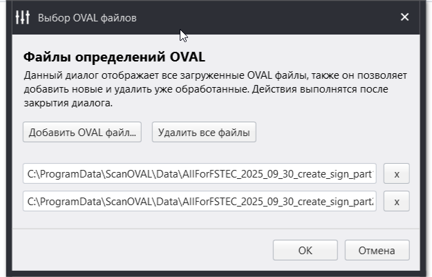
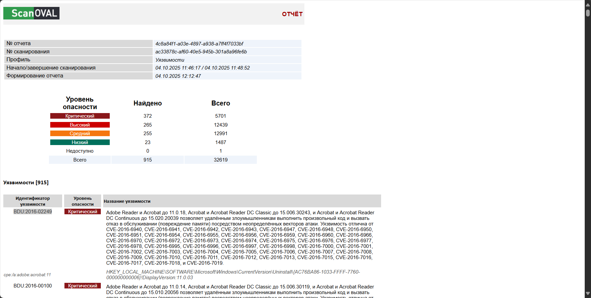
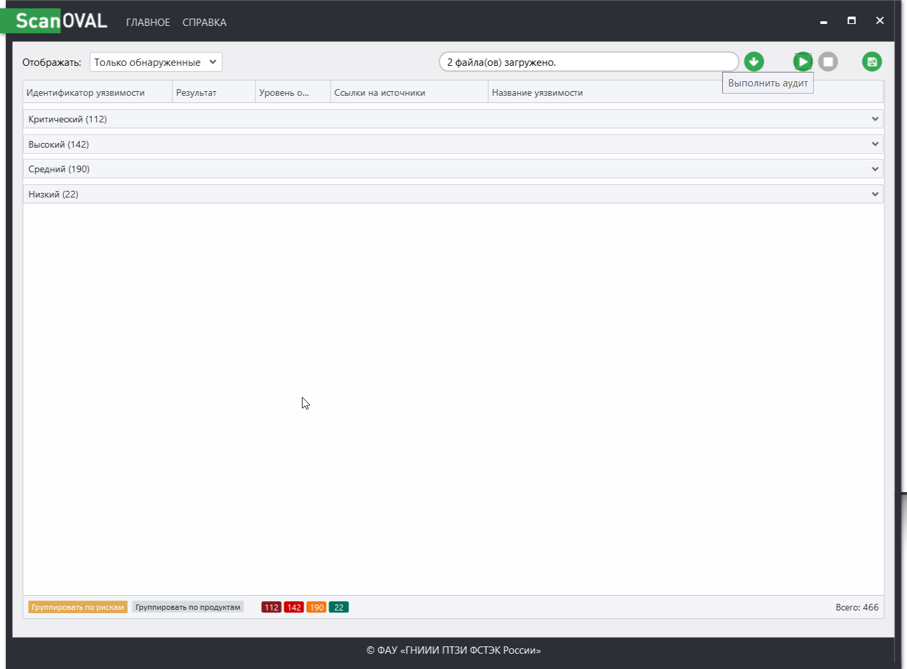

# Модуль 2. Построение системы защиты сети (HW)

## Сканирование хоста на предмет уязвимости с помощью Scan OVAL

### 1. Проведите сканирование хоста или сети на наличие уязвимостей.

Не буду приводить развернутый список результата скана уязвимостей своего хоста.
Результат сгруппирован по уровню уязвимости.

Критических - 372
Высоких - 265
Средних - 256
Низких - 25

В качестве базы уязвимостей использовались два файла определений с сайта https://bdu.fstec.ru/site/scanoval

### 2. Проанализируйте любую критическую уязвимость. Если критическая уязвимость отсутствует, то возьмите следующую по критичности.

Вот пример отчета, который был сгенерирован в html после проведения сканирования

Для анализа возьмем первую критическую уязвимость из полученного отчета:
`BDU:2016-02249`

#### 1. Что уязвимо?

Уязвимы Adobe Acrobat и Adobe Reader на Windows и macOS в версиях до релизов, указанных в бюллетене APSB16-33 (уязвимость входит в набор исправлений, выпущенных в октябре 2016). Конкретно уязвимые версии — это продукты до версий типа 11.0.18 для Acrobat/Reader 11.x и соответствующих сборок DC/Classic (см. бюллетень для точных номеров сборок).

Классификация уязвимости по типу: нарушение границ буфера / memory corruption (CWE-119), что может привести к удалённому выполнению кода.

#### 2. Как может быть реализована уязвимость? (вектор атаки / эксплуатация)

Вектор: злоумышленник создаёт специально-подготовленный PDF документ, который при открытии в уязвимой версии Acrobat/Reader вызывает ошибку управления памятью (memory corruption).

Результат: возможно удалённое выполнение произвольного кода с привилегиями процесса Acrobat/Reader или отказ в обслуживании (DoS) — в зависимости от детали памяти, которую повреждают. Типичные техники эксплуатации: внедрённый JavaScript в PDF, специально сформированные структуры объектов PDF (stream, font, image, annotation и т. п.) либо некорректная обработка встроенных форматов/сериализованных данных. 

Требования для эксплуатации: обычно — пользователь должен открыть/просмотреть вредоносный PDF (social engineering, вложение в e-mail или веб-ссылка). В ряде сценариев может потребоваться определённая комбинация флагов/опций продукта, но общий сценарий — удалённое исполнение при открытии.

#### Описание на CVE

CVE-2016-7014. Запись в NVD помечена как «Deferred» на странице NVD (не вся дополнительная обработка NVD присутствует), но NVD указывает соответствие с бюллетенем Adobe. Для практических деталей нужно смотреть Adobe APSB16-33 (официальный бюллетень Adobe), где CVE-ID перечислен среди исправленных уязвимостей в октябре 2016.

**Описание CVE-2016-7014:**

Adobe Reader и Acrobat до версии 11.0.18, Acrobat и Acrobat Reader DC Classic до версии 15.006.30243, а также Acrobat и Acrobat Reader DC Continuous до версии 15.020.20039 в Windows и OS X позволяют злоумышленникам выполнять произвольный код или вызывать отказ в обслуживании (повреждение памяти) через неуказанные векторы, что является уязвимостью, отличной от CVE-2016-6940, CVE-2016-6941, CVE-2016-6942, CVE-2016-6943, CVE-2016-6947, CVE-2016-6948, CVE-2016-6950, CVE-2016-6951, CVE-2016-6954, CVE-2016-6955, CVE-2016-6956, CVE-2016-6959, CVE-2016-6960, CVE-2016-6966, CVE-2016-6970, CVE-2016-6972, CVE-2016-6973, CVE-2016-6974, CVE-2016-6975, CVE-2016-6976, CVE-2016-6977, CVE-2016-6978, CVE-2016-6995, CVE-2016-6996, CVE-2016-6997, CVE-2016-6998, CVE-2016-7000, CVE-2016-7001, CVE-2016-7002, CVE-2016-7003, CVE-2016-7004, CVE-2016-7005, CVE-2016-7006, CVE-2016-7007, CVE-2016-7008, CVE-2016-7009, CVE-2016-7010, CVE-2016-7011, CVE-2016-7012, CVE-2016-7013, CVE-2016-7015, CVE-2016-7016, CVE-2016-7017, CVE-2016-7018 и CVE-2016-7019.

#### Как устранить уязвимость? (рекомендации)

1) Обновить ПО (главное действие). Установите обновления Adobe Acrobat/Reader, указанные в APSB16-33: обновить до версий, где CVE-2016-7014 исправлена (см. точные номера сборок в бюллетене — например, сборки 11.0.18, 15.006.30243, 15.020.20039 и выше для соответствующих веток). Это единственное корректное исправление уязвимости. 
helpx.adobe.com

2) Отключить JavaScript в Acrobat/Reader как временную меру снижения риска (если обновление невозможно немедленно) — это уменьшит вектор некоторых PDF-атак (но не гарантирует защиту от всех memory corruption уязвимостей).

3) Включить защищённый режим (Protected Mode / sandbox) и закрыть автоматические функции (например: автоматическое открытие вложений), если продукт это поддерживает.

4) Политики безопасности почты/браузера. Блокировать типы файлов .pdf во входящих письмах от непроверенных отправителей или настроить сканирование вложений антивирусом / sandboxes электронной почты.

5) Мониторинг и IDS/IPS. Внедрить/обновить правила обнаружения в сетевых IPS и почтовых шлюзах для выявления известных сигнатур/связанных эксплойтов (временное смягчение).

6) Минимизация прав. Запускать Acrobat/Reader с минимальными правами, применять политика групп (GPO) для контроля запуска исполняемых файлов и вложений.

7) Регрессионное тестирование. После установки патча — провести проверку (тест открытия ранее проблемных файлов, использование соответствующих тестовых кейсов), убедиться, что сборка обновлена и уязвимость отсутствует.

### 3. Устранение уязвимости

Для устранения критической уязвимости `BDU:2016-02249`, которая возникает в старом **Adobe Acrobat Reader v. 11** - данная версия программы была удалена и установлена последняя версия **Adobe Acrobat Reader v. 25**

### 4. Повторное сканирование хоста

Повторное сканирование хоста после устранения уязвимостей:

Старая версия Adobe Reader содержала очень много критических уязвимостей, поэтому удалив ее и установив последнюю версию было устранено их значительное количесвто:

Критических - 112
Высоких - 142
Средних - 190
Низких - 22
