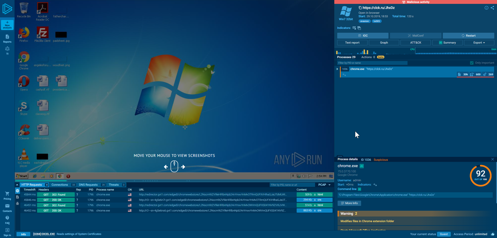
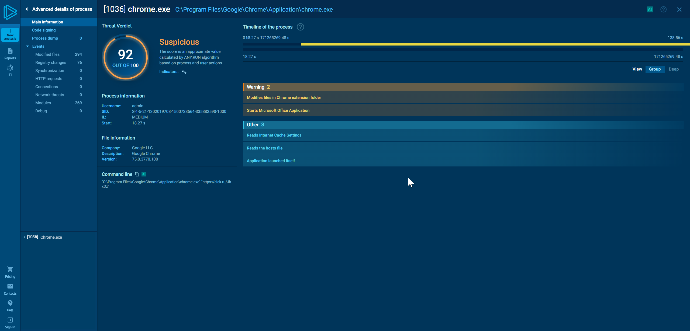
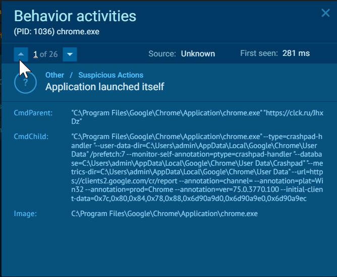
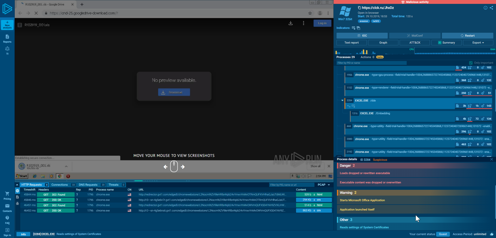
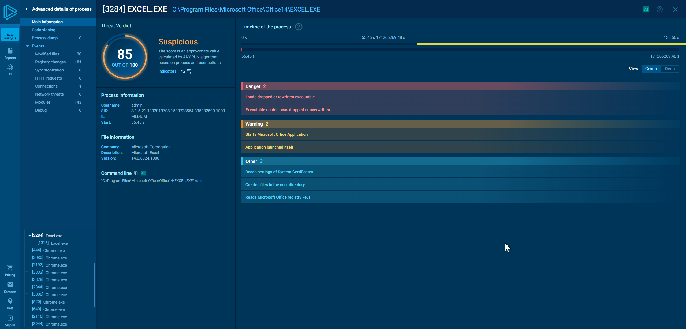
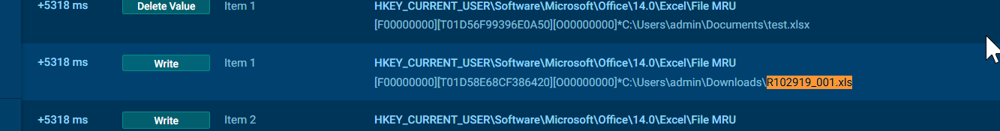
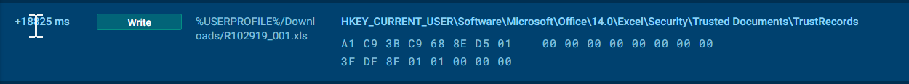
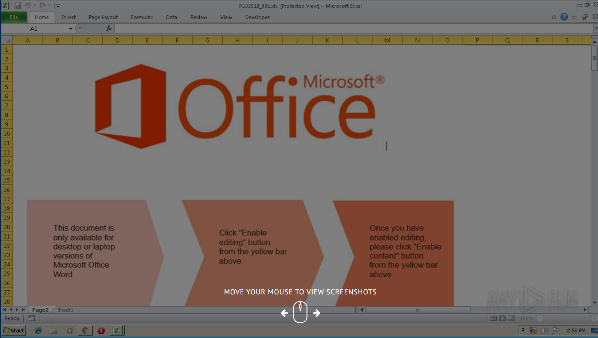
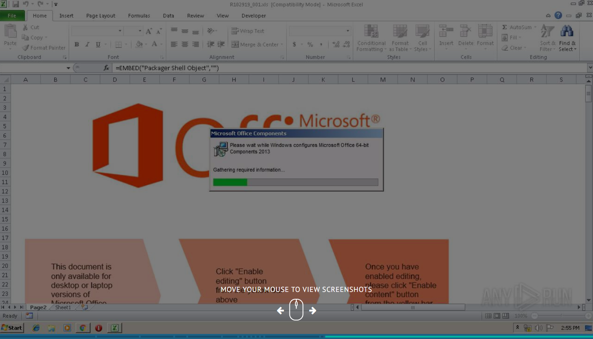

# Практическое задание №2: анализ отчета песочницы

## Задание 1. Исходя из демонстрируемых действий с файлом укажите способ доставки и способ запуска полезной нагрузки на хосте (user или non-user).

В отчете мы видим уведомление о Malicious activity, которое начинается в процессе chrome.exe

Если открыть детальную информацию по данному процессу ("More info"), то мы увидим, что приложение было запущено без участия пользователя ("Other -> Application launched itself")

Дополнительно можем открыть более подробную информацию и увидеть, что chrome.exe (PID: 1036) запущен из командной строки с параметром "https://clck.ru/JhxDz" - т.е. внешней ссылкой (на вредоносный ресурс)

Переход на указанную ссылку приводит к редиректу на скачивания вредоносного .xls файла из облачного хранилища и автоматического открытия данного файла в MS Excel.

Дополнительная информация по процессу [3284] EXCEL.EXE
C:\Program Files\Microsoft Office\Office14\EXCEL.EXE так же сообщает о том, что приложение было запущенно без участия пользователя (Warning: Application launched itself)

### Таким образом, делаем вывод, что способ запуска полезной нагрузки на хосте `non-user`

## Задание 2. Укажите полный путь исследуемого файла на диске.

### Полный путь исследуемого файла на диске: C:\Users\admin\Downloads\R102919_001.xls

## Задание 3. На основе текстового отчета выпишите признаки вредоносного поведения файла.

### Механизм атаки:

#### 1. Первый файл (с Protected View):

Загружается автоматически через Chrome
Excel открывает его в Protected View (безопасный режим)
В Protected View макросы не выполняются, но этот файл может содержать механизм для обхода или триггер

#### 2. Второй этап (изменение реестра):
После выполнения макросов Excel автоматически записывает файл в Trusted Documents. Это происходит через запись в реестр

#### 3. Третий этап (персистентность):
Файл теперь в списке доверенных. При следующем открытии (видно что открыто 2 экземпляра файла) - макросы будут выполняться автоматически, без предупреждений - это обеспечивает персистентность атаки.

#### 4. Финальный файл с EMBED:
Это тот же второй файл или результат обработки.
Формула EMBED("Packager Shell Object","") уже готова к выполнению
Файл больше не в Protected View, поэтому формула может выполниться

## Это двухэтапная атака:
Первый файл — обход Protected View и запуск второго этапа. 
Второй файл — содержит EMBED и выполняется без ограничений.
Вероятно, первый файл использует внешние ссылки или DDE для автоматической загрузки и открытия второго файла, минуя Protected View. Это объясняет, почему в итоге виден только один файл с формулой EMBED — второй файл заменил первый или это тот же файл, открытый другим способом.
Признак вредоносного поведения: Автоматическое открытие второго файла без участия пользователя и обход Protected View.

EMBED("Packager Shell Object","") — альтернатива DDE для обхода защиты макросов. Используется для автоматического запуска кода без предупреждений о макросах, что часто является частью многоэтапной атаки.